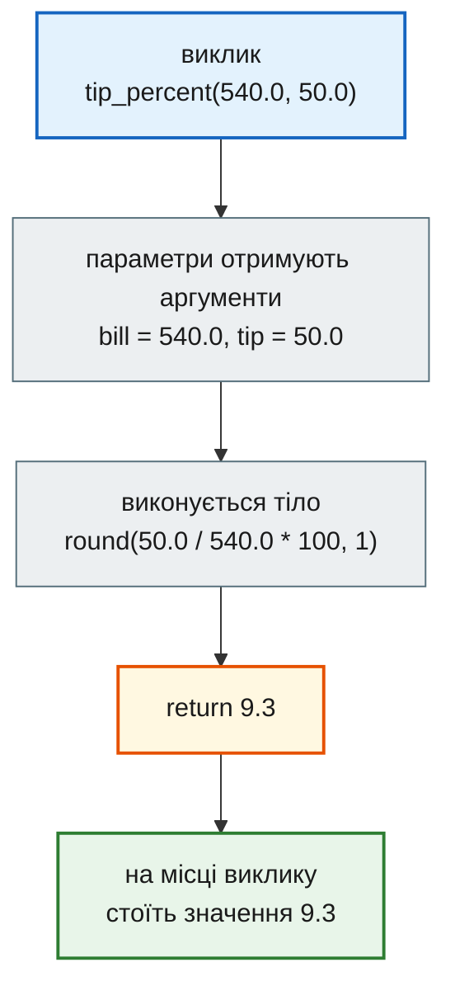
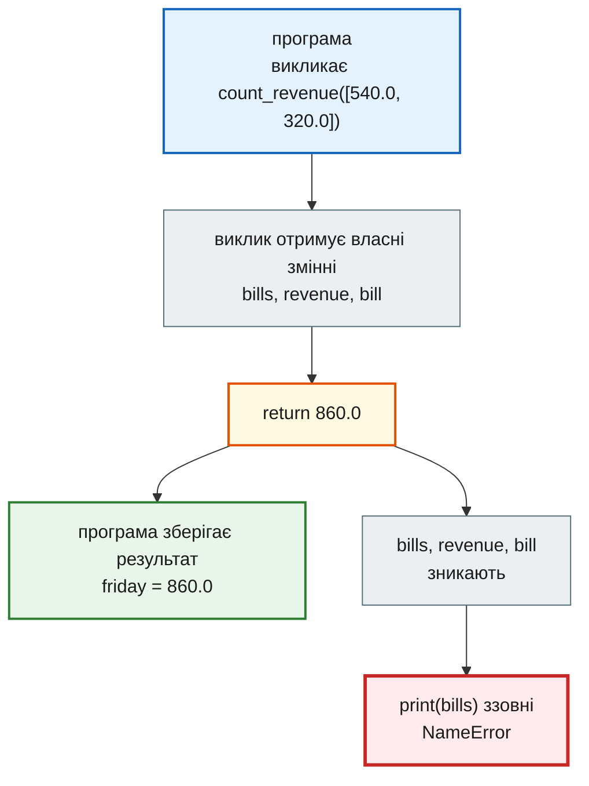
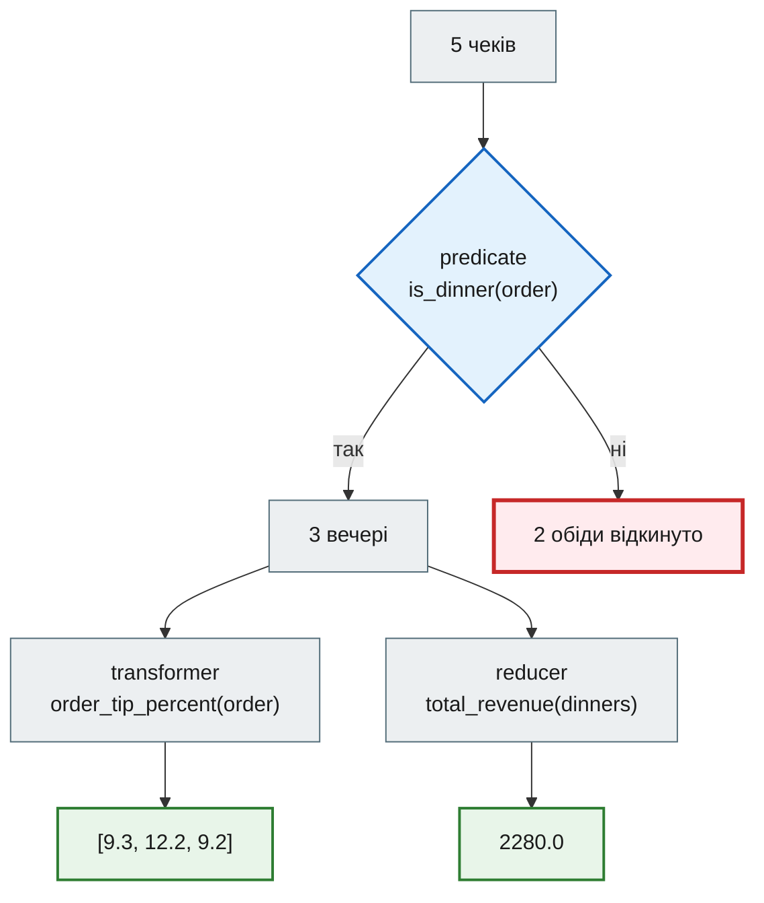
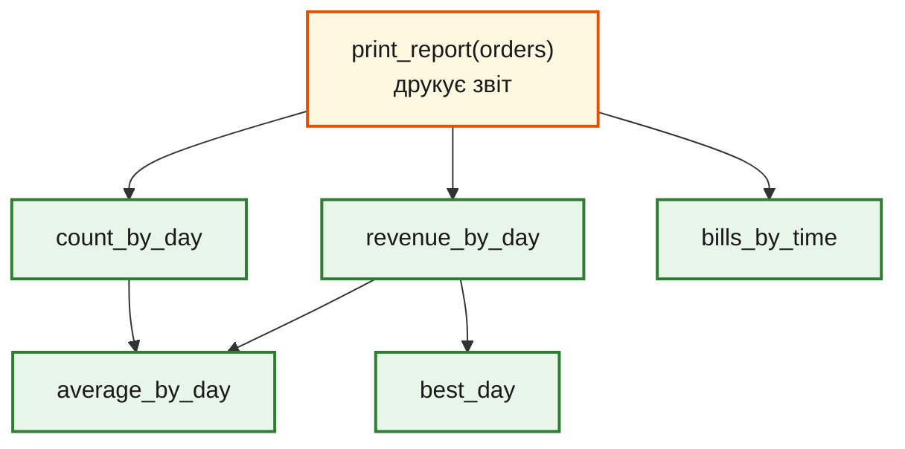

# Урок 8. Функції

В уроці 6 кафе отримало повний звіт: кількість чеків, виторг і середній чек за днями, найкращий день, чеки за прийомом їжі. Програма працює, але це один суцільний блок коду на тридцять рядків. Щоб зробити такий самий звіт за інший тиждень, його доведеться скопіювати. Щоб перевірити, чи правильно рахується лише виторг, доведеться запускати все. А щоб зрозуміти, що робить рядок 26, треба прочитати всі попередні.

**Функція** — це шматок коду з іменем, входом і результатом. Її пишуть один раз, а викликають скільки завгодно разів з різними даними. У цьому уроці ми розкладемо звіт кафе на функції так, щоб він давав **той самий** результат, але читався як перелік кроків.

**Що потрібно з попередніх уроків:** `if` і `while` (урок 4), списки, кортежі і `NamedTuple Order` (урок 5), цикл `for`, словники й comprehensions (урок 6).

**Після уроку ти зможеш:**

- оголошувати функцію через `def` і викликати її;
- розрізняти `return` і `print()` та пояснювати, звідки береться `None`;
- передавати аргументи за порядком і за іменем;
- задавати параметрам значення за замовчуванням і уникати пастки зі змінюваним значенням;
- пояснювати, чому змінні всередині функції не видно ззовні;
- писати чисті функції трьох ролей — перевірка (predicate), перетворення (transformer), згортка (reducer);
- розкладати довгу програму на функції й перевіряти, що результат не змінився.

У [поглибленні](#flexible-params) наприкінці уроку — функції, що приймають скільки завгодно аргументів (`*args`, `**kwargs`), розпаковка колекцій зірочками, позначки `/` і `*` та повна картина п'яти видів параметрів.

**Задача розділу.** Переписати звіт кафе з уроку 6 як набір функцій і отримати ідентичний вивід. Повний код — у розділі [«Практика»](#practice).

**Ноутбук заняття:** [Відкрити вправи в Colab](https://colab.research.google.com/github/NikoriakViktot/PY-Course-Victor-Nikoriak-22-09-2026/blob/main/module_1/lessons/lesson_08_functions/note_lesson_08_functions_student.ipynb){ .md-button .md-button--primary } [Переглянути розв’язки](https://github.com/NikoriakViktot/PY-Course-Victor-Nikoriak-22-09-2026/blob/main/module_1/lessons/lesson_08_functions/note_lesson_08_functions.ipynb){ .solutions-link }

## Пригадай

Дай відповідь подумки, нічого не запускаючи:

1. Що потрапить у `day` і `revenue` у циклі `for day, revenue in revenue_by_day.items():`?
2. Що побудує `[order.total_bill for order in orders if order.time == "обід"]`?
3. Навіщо у звіті уроку 6 перед пошуком найкращого дня стоїть `best_day = None`?

??? success "Відповіді"

    1. На кожному кроці — одна пара словника: `day` отримує ключ (день), `revenue` — значення (виторг цього дня).
    2. Новий список сум лише тих чеків, де прийом їжі — обід. Для чеків уроку 6 це `[320.0, 450.0]`.
    3. Це позначка «лідера ще немає». Перший день стає лідером без порівняння, далі кожен наступний порівнюється з поточним лідером.

## Навіщо функції

Кафе хоче знати частку чайових у кількох чеках. Без функцій формула повторюється:

```python
tip_1 = round(50.0 / 540.0 * 100, 1)
tip_2 = round(120.0 / 980.0 * 100, 1)
tip_3 = round(70.0 / 760.0 * 100, 1)
print(tip_1, tip_2, tip_3)
```

```text
9.3 12.2 9.2
```

Три копії однієї ідеї. Якщо кафе вирішить рахувати чайові з точністю до цілого, доведеться знайти й виправити кожну копію — і легко пропустити одну. Функція збирає формулу в одне місце:

```python
def tip_percent(bill, tip):
    return round(tip / bill * 100, 1)


print(tip_percent(540.0, 50.0), tip_percent(980.0, 120.0), tip_percent(760.0, 70.0))
```

```text
9.3 12.2 9.2
```

Тепер формула записана один раз, а в кожному рядку, де вона потрібна, стоїть **ім'я**, яке пояснює, що рахується. Функції розв'язують три проблеми одразу:

- **повторення** — логіку змінюють в одному місці;
- **читабельність** — `tip_percent(540.0, 50.0)` зрозуміліше, ніж `round(50.0 / 540.0 * 100, 1)`;
- **перевірка частинами** — функцію можна випробувати окремо, не запускаючи всю програму.

## Оголошення і виклик

### Будова функції

```python
def tip_percent(bill, tip):
    return round(tip / bill * 100, 1)
```

| Частина | Що означає |
|---|---|
| `def` | ключове слово: «оголошую функцію» |
| `tip_percent` | ім'я функції — за тими самими правилами, що й імена змінних |
| `(bill, tip)` | **параметри** — імена, під якими функція отримає вхідні дані |
| `:` і відступ | тіло функції — усі рядки з відступом під `def` |
| `return …` | **результат**: значення, яке функція віддає туди, звідки її викликали |

Рядок `tip_percent(540.0, 50.0)` — це **виклик**. Значення в дужках — **аргументи**: `540.0` потрапляє в параметр `bill`, `50.0` — у `tip`. Після виконання тіла весь вираз виклику замінюється значенням з `return`.



### Оголошення не запускає код

`def` лише створює функцію і прив'язує її до імені. Тіло виконується тоді, коли функцію **викликають**, і стільки разів, скільки її викликають.

```python
def greet_guest(name):
    print("Вітаємо,", name)


print("Кафе відкрито")
greet_guest("Олена")
greet_guest("Тарас")
```

```text
Кафе відкрито
Вітаємо, Олена
Вітаємо, Тарас
```

Хоча `def` стоїть першим, перший рядок виводу — «Кафе відкрито»: на момент `def` Python лише запам'ятав, що робити, коли покличуть `greet_guest`.

!!! warning "Виклик без дужок"
    `greet_guest` без дужок — це сама функція як значення, а не її виклик. Рядок `greet_guest` нічого не надрукує, а `print(greet_guest)` покаже щось на зразок `<function greet_guest at 0x7f...>`. Якщо функція «не спрацювала» — перевір, чи є дужки.

Функцію треба оголосити **до** першого виклику: Python читає файл згори донизу, і виклик імені, якого ще немає, дає `NameError`.

### Двокрапка і відступ

Рядок `def` закінчується двокрапкою, а тіло пишуть з відступом — так само, як в `if` і `for`. Без двокрапки Python не запустить жодного рядка файлу:

```python
def greet_guest(name)
    print("Вітаємо,", name)
```

```text
SyntaxError: expected ':'
```

Без відступу Python не бачить тіла функції:

```python
def greet_guest(name):
print("Вітаємо,", name)
```

```text
IndentationError: expected an indented block after function definition on line 1
```

Обидві помилки Python знаходить ще **до** запуску програми, тому не виконується навіть код над функцією.

## return і print

### Для людини чи для програми

`print()` показує значення **людині** на екрані. `return` віддає значення **програмі**, щоб його можна було зберегти в змінну й використати далі. Функція без `return` усе одно щось повертає — спеціальне значення `None`, «нічого».

```python
def show_revenue(bills):
    revenue = 0
    for bill in bills:
        revenue += bill
    print("Виторг:", revenue)


def count_revenue(bills):
    revenue = 0
    for bill in bills:
        revenue += bill
    return revenue
```

Обидві функції рахують однаково. Різниця — у тому, що отримає код, який їх викликав.

```python
shown = show_revenue([540.0, 320.0])
counted = count_revenue([540.0, 320.0])
print(shown)
print(counted)
print(counted * 2)
```

??? question "Що надрукує цей код?"

    Зверни увагу: скільки рядків надрукує `show_revenue`, а скільки — останні три `print()`?

??? success "Відповідь і пояснення"

    ```text
    Виторг: 860.0
    None
    860.0
    1720.0
    ```

    Перший рядок друкує сама `show_revenue` під час виклику. Але в `shown` потрапляє `None`: у функції немає `return`. `count_revenue` нічого не друкує, зате її результат — число `860.0`, з яким можна рахувати далі.

Спроба рахувати з результатом `show_revenue` закінчується помилкою:

```python
print(shown * 2)
```

```text
TypeError: unsupported operand type(s) for *: 'NoneType' and 'int'
```

Правило: функція, яка **рахує**, повертає результат через `return`. Друкує той код, якому результат потрібно показати.

### return завершує функцію

Щойно виконується `return`, функція закінчує роботу — решта тіла пропускається. Тому в одній функції може бути кілька `return` у різних гілках:

```python
def bill_size(bill):
    if bill >= 800:
        return "великий"
    if bill >= 400:
        return "середній"
    return "малий"


print(bill_size(980.0), bill_size(540.0), bill_size(320.0))
```

```text
великий середній малий
```

Для `980.0` перша умова істинна, і функція завершується одразу — до інших `if` справа не доходить. Тому другу умову не треба писати як `400 <= bill < 800`.

Але той самий механізм дає одну з найчастіших помилок — `return` з зайвим відступом, усередині циклу:

```python
def broken_revenue(bills):
    revenue = 0
    for bill in bills:
        revenue += bill
        return revenue


print(broken_revenue([540.0, 320.0, 980.0]))
```

```text
540.0
```

| Крок | Що відбувається | `revenue` |
|---|---|---|
| старт | `revenue = 0` | `0` |
| перший чек | `revenue += 540.0` | `540.0` |
| той самий крок | `return revenue` — функція завершується | `540.0` |

Цикл не дійшов до другого чека. `return` має стояти **після** циклу, на рівні `for`, — як у `count_revenue`.

Звідси ж ще один наслідок: рядки **після** `return` у тому самому блоці ніколи не виконуються. Такий код називають мертвим:

```python
def with_discount(bill):
    return bill * 0.9
    print("Знижку застосовано")


print(with_discount(500.0))
```

```text
450.0
```

Повідомлення «Знижку застосовано» не з'явиться ніколи: до нього виконання просто не доходить.

### Гілка без return

Якщо жоден `return` не спрацював, функція завершується, дійшовши до кінця тіла, і повертає `None` — так само, як функція без `return` взагалі. Прибери з `bill_size` останній рядок:

```python
def bill_size_broken(bill):
    if bill >= 800:
        return "великий"
    if bill >= 400:
        return "середній"


print(bill_size_broken(980.0), bill_size_broken(320.0))
```

```text
великий None
```

Для чека `320.0` жодна умова не виконалась, і функція непомітно повернула `None`. Помилки немає — вона з'явиться пізніше, коли з цим `None` спробують щось зробити. Тому, коли пишеш функцію з кількома `return`, перевір, що **кожен** шлях через `if` закінчується `return`, і випробуй її на значенні для кожної гілки.

### Кілька результатів

Функція повертає одне значення, але це значення може бути кортежем. Розпакування з уроку 5 розкладає його на змінні:

```python
def day_summary(bills):
    return len(bills), sum(bills)


count, revenue = day_summary([540.0, 320.0])
print(count, revenue)
print(day_summary([450.0]))
```

```text
2 860.0
(1, 450.0)
```

Запис `return len(bills), sum(bills)` — це `return (len(bills), sum(bills))`: кома створює кортеж.

## Параметри й аргументи

### Позиційні та іменовані аргументи { #positional-keyword }

Позиційні аргументи розподіляються за порядком: перший — у перший параметр, другий — у другий. Переплутаний порядок Python не помітить:

```python
print(tip_percent(540.0, 50.0))
print(tip_percent(50.0, 540.0))
```

```text
9.3
1080.0
```

Чайові 1080 % — безглуздя, але помилки немає: обидва аргументи — числа. Коли параметрів кілька, аргументи можна передати **за іменем**, і тоді порядок не важливий:

```python
print(tip_percent(tip=50.0, bill=540.0))
```

```text
9.3
```

Обидва способи можна поєднувати, але в певному порядку: спершу позиційні аргументи, потім іменовані. `tip_percent(540.0, tip=50.0)` працює, а навпаки — ні:

```python
print(tip_percent(bill=540.0, 50.0))
```

```text
SyntaxError: positional argument follows keyword argument
```

Такий порядок аргументів заборонений синтаксисом Python: спершу аргументи без імені, потім з іменем.

### Значення за замовчуванням { #default-values }

Параметр може мати значення, яке використовується, якщо аргумент не передали. Наприклад, плата за обслуговування зазвичай 10 %:

```python
def price_with_service(bill, service=10):
    return bill + bill * service / 100


print(price_with_service(500.0))
print(price_with_service(500.0, 5))
print(price_with_service(500.0, service=0))
```

```text
550.0
525.0
500.0
```

Параметри зі значенням за замовчуванням пишуть **після** обов'язкових: `def f(service=10, bill):` — це `SyntaxError`.

Python перевіряє кількість аргументів у момент виклику. Забутий обов'язковий аргумент:

```python
price_with_service()
```

```text
TypeError: price_with_service() missing 1 required positional argument: 'bill'
```

Зайвий аргумент:

```python
price_with_service(500.0, 5, 3)
```

```text
TypeError: price_with_service() takes from 1 to 2 positional arguments but 3 were given
```

!!! warning "Список як значення за замовчуванням"
    Значення за замовчуванням створюється **один раз** — коли виконується `def`, а не при кожному виклику. Для числа чи рядка це непомітно, а для списку — пастка:

    ```python
    def add_item(item, items=[]):
        items.append(item)
        return items


    print(add_item("кава"))
    print(add_item("чай"))
    ```

    ```text
    ['кава']
    ['кава', 'чай']
    ```

    Другий виклик «пам'ятає» каву з першого: обидва працюють з одним і тим самим списком. Правильний запис — `None` за замовчуванням і новий список усередині:

    ```python
    def add_item(item, items=None):
        if items is None:
            items = []
        items.append(item)
        return items


    print(add_item("кава"))
    print(add_item("чай"))
    ```

    ```text
    ['кава']
    ['чай']
    ```

## Змінні всередині функції

Параметри й змінні, створені в тілі функції, — **локальні**. Вони з'являються під час виклику й зникають, коли функція повертає результат. Кожен виклик отримує свій окремий набір локальних змінних.

```python
friday = count_revenue([540.0, 320.0])
print(friday)
print(bills)
```

```text
860.0
NameError: name 'bills' is not defined
```

`bills` і `revenue` існували лише всередині виклику `count_revenue`. Ззовні доступний тільки результат — його ми зберегли в `friday`.



З цього випливають дві корисні речі:

- **однакові імена не конфліктують.** Змінна `revenue` у `count_revenue` і змінна `revenue` у `show_revenue` — різні змінні. Не треба вигадувати унікальні імена для кожного шматка програми;
- **функція залежить лише від того, що їй передали.** Дані потрапляють у функцію через параметри, а виходять через `return`. Так функцію легко перевірити окремо.

!!! note "А якщо функція читає змінну ззовні?"
    Прочитати змінну, створену поза функцією, Python дозволяє — він шукає ім'я спочатку серед локальних, потім у файлі. Але така функція непомітно залежить від решти програми: змінив змінну вгорі — змінився результат функції. Передавай дані параметрами. Як саме Python шукає імена, розібрано в довіднику [Простори імен / LEGB](../../reference/python_core/namespaces_legb.md).

## Чисті функції { #pure-functions }

Функція може не лише повертати результат, а й змінювати щось поза собою — наприклад, список, який їй передали. Це називають **побічним ефектом**. Згадай урок 5: параметр отримує посилання на той самий список, а не копію.

```python
def add_service_in_place(bills, service):
    for i in range(len(bills)):
        bills[i] = bills[i] + bills[i] * service / 100


def with_service(bills, service):
    return [bill + bill * service / 100 for bill in bills]


friday_bills = [540.0, 320.0]
new_bills = with_service(friday_bills, 10)
print(friday_bills, new_bills)

add_service_in_place(friday_bills, 10)
print(friday_bills)
```

```text
[540.0, 320.0] [594.0, 352.0]
[594.0, 352.0]
```

`with_service` будує **новий** список і не чіпає вхідний. `add_service_in_place` переписує список, який їй дали: після виклику первинні суми чеків утрачено.

Функцію називають **чистою**, якщо:

1. за однакових аргументів вона завжди повертає однаковий результат;
2. вона не змінює нічого поза собою: ні переданих списків і словників, ні зовнішніх змінних, і нічого не друкує.

Чисту функцію найпростіше перевірити: викликав — порівняв результат з очікуваним. Тому функції, що **рахують**, пишемо чистими, а друк збираємо в одну окрему функцію звіту. Функції зі змінюванням на місці теж бувають потрібні (як метод `.sort()` у списку), але тоді це має бути зрозуміло з імені та опису.

## Три ролі функцій

Більшість функцій, що обробляють дані, належать до однієї з трьох ролей:

| Роль | Питання | Що повертає |
|---|---|---|
| **predicate** (перевірка) | чи підходить цей елемент? | `True` або `False` |
| **transformer** (перетворення) | яким стане цей елемент? | нове значення для одного елемента |
| **reducer** (згортка) | що вийде з усіх разом? | одне значення з багатьох |

Візьмемо чеки кафе з уроку 6:

```python
from typing import NamedTuple


class Order(NamedTuple):
    total_bill: float
    tip: float
    day: str
    time: str
    size: int


orders = [
    Order(540.0, 50.0, "пт", "вечеря", 2),
    Order(320.0, 30.0, "пт", "обід", 1),
    Order(980.0, 120.0, "сб", "вечеря", 4),
    Order(760.0, 70.0, "сб", "вечеря", 3),
    Order(450.0, 0.0, "нд", "обід", 5),
]
```

Три маленькі функції — по одній на кожну роль:

```python
def is_dinner(order):
    return order.time == "вечеря"


def order_tip_percent(order):
    return tip_percent(order.total_bill, order.tip)


def total_revenue(orders):
    revenue = 0
    for order in orders:
        revenue += order.total_bill
    return revenue


dinners = [order for order in orders if is_dinner(order)]
print("Вечерь:", len(dinners))
print("Чайові, %:", [order_tip_percent(order) for order in dinners])
print("Виторг вечерь:", total_revenue(dinners))
```

```text
Вечерь: 3
Чайові, %: [9.3, 12.2, 9.2]
Виторг вечерь: 2280.0
```

Зверни увагу на `order_tip_percent`: вона не повторює формулу, а викликає вже готову `tip_percent`. Функції складаються з інших функцій так само, як програма складається з функцій.



Predicate і transformer працюють з **одним** елементом, тому їх зручно ставити в comprehension. Reducer отримує **весь** список. Вбудовані `sum()`, `len()`, `max()` — теж reducer-и.

??? question "Яка це роль?"

    1. `def is_big_table(order): return order.size >= 4`
    2. `def to_dollars(bill): return round(bill / 41.5, 2)`
    3. `def max_bill(orders): …` — найбільша сума серед чеків

??? success "Відповіді"

    1. Predicate: для одного чека відповідає «так» чи «ні».
    2. Transformer: одна сума в гривнях → одна сума в доларах.
    3. Reducer: зі списку чеків отримуємо одне число.

## Як розкласти програму на функції

Повернімося до звіту з уроку 6. Щоб знайти майбутні функції, шукай у довгому коді шматки, які:

- відповідають на **одне** питання — «скільки чеків за днями?», «який найкращий день?»;
- мають зрозумілий **вхід** (що їм потрібно) і **вихід** (що вони дають далі).

| Шматок звіту уроку 6 | Функція | Вхід → вихід |
|---|---|---|
| лічильник чеків за днями | `count_by_day(orders)` | чеки → `{день: кількість}` |
| виторг за днями | `revenue_by_day(orders)` | чеки → `{день: сума}` |
| середній чек | `average_by_day(counts, revenue)` | два словники → `{день: середнє}` |
| пошук лідера | `best_day(revenue)` | `{день: сума}` → день |
| групування за прийомом їжі | `bills_by_time(orders)` | чеки → `{прийом: [суми]}` |
| друк | `print_report(orders)` | чеки → текст на екрані |

Перші п'ять функцій лише рахують і повертають результат — вони чисті. Друкує тільки `print_report`: вона викликає решту і показує їхні результати.



Три правила, які допомагають:

1. **Одна функція — одна задача.** Якщо функцію важко назвати, не вживши «і», — вона робить забагато.
2. **Ім'я описує результат або дію:** `count_by_day`, `best_day`, `print_report`, а не `func1` чи `process`.
3. **Спершу перевір кожну функцію окремо**, потім збирай їх разом. Помилку в маленькій функції знайти легше, ніж у тридцяти рядках.

!!! note "Рядок документації"
    Перший рядок у тілі функції можна зробити рядком у лапках — **docstring**. Він коротко пояснює, що функція робить. Python зберігає його, і `help(count_by_day)` або підказка в редакторі покаже цей опис. У прикладі нижче в кожної функції є docstring.

## Практика { #practice }

### Розібраний приклад: звіт кафе з функцій

Той самий звіт, що в уроці 6, але розкладений на функції.

```python linenums="1" hl_lines="12 20 28 33 42 50 69"
from typing import NamedTuple


class Order(NamedTuple):
    total_bill: float
    tip: float
    day: str
    time: str
    size: int


def count_by_day(orders):
    """Кількість чеків у кожен день."""
    counts = {}
    for order in orders:
        counts[order.day] = counts.get(order.day, 0) + 1
    return counts


def revenue_by_day(orders):
    """Сума чеків за кожен день."""
    revenue = {}
    for order in orders:
        revenue[order.day] = revenue.get(order.day, 0) + order.total_bill
    return revenue


def average_by_day(counts, revenue):
    """Середній чек за кожен день."""
    return {day: revenue[day] / counts[day] for day in revenue}


def best_day(revenue):
    """День з найбільшим виторгом."""
    best = None
    for day, amount in revenue.items():
        if best is None or amount > revenue[best]:
            best = day
    return best


def bills_by_time(orders):
    """Суми чеків, згруповані за прийомом їжі."""
    groups = {}
    for order in orders:
        groups.setdefault(order.time, []).append(order.total_bill)
    return groups


def print_report(orders):
    """Друкує звіт кафе за списком чеків."""
    counts = count_by_day(orders)
    revenue = revenue_by_day(orders)
    average = average_by_day(counts, revenue)
    for day in revenue:
        print(day, "— чеків:", counts[day], "виторг:", revenue[day], "середній:", average[day])
    print("Найкращий день:", best_day(revenue))
    print("За прийомом їжі:", bills_by_time(orders))


orders = [
    Order(540.0, 50.0, "пт", "вечеря", 2),
    Order(320.0, 30.0, "пт", "обід", 1),
    Order(980.0, 120.0, "сб", "вечеря", 4),
    Order(760.0, 70.0, "сб", "вечеря", 3),
    Order(450.0, 0.0, "нд", "обід", 5),
]

print_report(orders)
```

```text
пт — чеків: 2 виторг: 860.0 середній: 430.0
сб — чеків: 2 виторг: 1740.0 середній: 870.0
нд — чеків: 1 виторг: 450.0 середній: 450.0
Найкращий день: сб
За прийомом їжі: {'вечеря': [540.0, 980.0, 760.0], 'обід': [320.0, 450.0]}
```

Вивід збігається з уроком 6 символ у символ — рефакторинг не змінив поведінку програми.

Що відбувається в ключових рядках:

- **рядки 12, 20, 42** — кожен накопичувальний словник з уроку 6 тепер живе у власній функції: створюється всередині, заповнюється циклом і повертається через `return`;
- **рядок 28** — `average_by_day` не проходить чеки заново, а отримує два вже готові словники;
- **рядок 33** — пошук лідера з уроку 6 без змін, але тепер `best` — локальна змінна, а результат повертається;
- **рядок 50** — `print_report` — єдина функція, яка друкує: вона збирає результати інших;
- **рядки 52–58** — тіло `print_report` читається як перелік кроків звіту: порахувати, порахувати, обчислити середнє, надрукувати;
- **рядок 69** — увесь звіт — один виклик.

Перевага видна одразу, щойно з'являються **інші дані**. Звіт за інший вікенд — це один виклик, без копіювання коду:

```python
next_weekend = [
    Order(610.0, 60.0, "сб", "обід", 2),
    Order(1200.0, 150.0, "нд", "вечеря", 6),
]
print_report(next_weekend)
```

```text
сб — чеків: 1 виторг: 610.0 середній: 610.0
нд — чеків: 1 виторг: 1200.0 середній: 1200.0
Найкращий день: нд
За прийомом їжі: {'обід': [610.0], 'вечеря': [1200.0]}
```

А кожну функцію можна перевірити окремо, на маленьких даних, де відповідь відома заздалегідь:

```python
print(best_day({"пт": 100.0, "сб": 300.0, "нд": 200.0}))
print(count_by_day([]))
print(best_day({}))
```

```text
сб
{}
None
```

!!! note "Три проходи замість одного"
    В уроці 6 один цикл заповнював усі словники одразу. Тепер `count_by_day`, `revenue_by_day` і `bills_by_time` проходять чеки кожна окремо — три проходи. Для сотень чи тисяч чеків різниці не видно, а код читається й перевіряється частинами. Як оцінювати, скільки роботи робить програма, розберемо в [уроці 9](lesson_09.md).

### Зміни приклад: звіт про вечері

Додай до програми з розібраного прикладу функції трьох ролей (дві з них ти вже бачив у розділі «Три ролі функцій» — напиши їх заново, не підглядаючи):

- `is_dinner(order)` — predicate: чи чек за вечерю;
- `order_tip_percent(order)` — transformer: частка чайових чека у відсотках, округлена до одного знака;
- `average(values)` — reducer: середнє значення списку чисел.

І функцію `print_dinner_report(orders)`, яка з їхньою допомогою друкує:

```text
Вечерь: 3
Чайові на вечері, %: [9.3, 12.2, 9.2]
Середні чайові на вечері: 10.2 %
```

**Критерії перевірки:**

- `is_dinner`, `order_tip_percent` і `average` нічого не друкують, лише повертають результат;
- `average([])` повертає `0.0`, а не падає з `ZeroDivisionError`;
- середнє округлюється лише під час друку, `average` повертає неокруглене значення;
- `print_dinner_report(next_weekend)` друкує 1 вечерю з чайовими `12.5` %.

??? tip "Підказка"
    Список вечерь — comprehension з `if is_dinner(order)`, список відсотків — comprehension з `order_tip_percent(order)` по вечерях. В `average` спершу перевір, чи список порожній, а для суми й кількості скористайся `sum()` і `len()`.

### Спробуй самостійно: журнал оцінок

В уроці 6 ти писав програму для журналу оцінок одним блоком. Тепер розклади її на функції. Записи ті самі — кортежі `(студент, предмет, оцінка)`:

```python
grades = [
    ("Олена", "математика", 10),
    ("Тарас", "математика", 7),
    ("Олена", "фізика", 12),
    ("Марта", "математика", 11),
    ("Тарас", "фізика", 9),
    ("Олена", "математика", 8),
]
```

Напиши функції:

- `count_by_student(grades)` → `{студент: кількість оцінок}`;
- `average_by_student(grades)` → `{студент: середній бал}`;
- `subjects_by_student(grades)` → `{студент: відсортований список предметів без повторів}`;
- `best_student(averages)` → ім'я студента з найвищим середнім балом;
- `print_journal(grades)` — друкує звіт, викликаючи функції вище.

Виклик `print_journal(grades)` має надрукувати:

```text
Кількість оцінок: {'Олена': 3, 'Тарас': 2, 'Марта': 1}
Середній бал: {'Олена': 10.0, 'Тарас': 8.0, 'Марта': 11.0}
Предмети: {'Олена': ['математика', 'фізика'], 'Тарас': ['математика', 'фізика'], 'Марта': ['математика']}
Найкращий середній бал: Марта
```

**Критерії перевірки:**

- друкує лише `print_journal`, усі інші функції повертають результат;
- жодна функція не змінює список `grades`;
- `best_student({})` повертає `None`, а `print_journal([])` не падає;
- якщо додати запис `("Марта", "фізика", 5)`, найкращою стане Олена — без змін у коді функцій.

## Поглиблення: гнучкі параметри { #flexible-params }

Звіт кафе вже працює, і для нього цього розділу не потрібно. Тут — можливості, які знадобляться далі: функція, що приймає скільки завгодно значень (урок 10 побудований саме на цьому), і позначки `/` та `*`, які трапляються в документації Python. Кожна ідея — окремий крок: знайома задача, маленька зміна в коді, результат, пояснення.

### Скільки завгодно чеків: `*args`

Функція `tip_percent` приймає рівно два значення. А як порахувати суму чеків за столиком, якщо їх може бути один, а може й п'ять? Поставимо зірочку перед параметром:

```python
def order_total(*bills):
    print("  bills =", bills)
    return sum(bills)


print(order_total(540.0))
print(order_total(540.0, 980.0, 760.0))
print(order_total())
```

```text
  bills = (540.0,)
540.0
  bills = (540.0, 980.0, 760.0)
2280.0
  bills = ()
0
```

Зірочка в оголошенні означає: **збери всі передані значення в один кортеж**. Без аргументів кортеж просто порожній — це не помилка. Із кортежем працюємо як завжди: перебираємо циклом, беремо за індексом. Змінити його не можна:

```python
def show_bills(*bills):
    for i, bill in enumerate(bills):
        print("  #", i, "->", bill)
    print("  перший:", bills[0], "| останній:", bills[-1])
    bills[0] = 0.0


show_bills(540.0, 980.0, 760.0)
```

```text
  # 0 -> 540.0
  # 1 -> 980.0
  # 2 -> 760.0
  перший: 540.0 | останній: 760.0
TypeError: 'tuple' object does not support item assignment
```

Звичайні параметри перед зірочкою забирають свої значення першими, решта йде в кортеж:

```python
def split_bill(guests, *bills):
    print("  guests =", guests, "| bills =", bills)
    return round(sum(bills) / guests, 2)


print(split_bill(3, 540.0, 980.0))
```

```text
  guests = 3 | bills = (540.0, 980.0)
506.67
```

Ім'я після зірочки може бути будь-яким. Найчастіше пишуть `*args` (від *arguments*), але працює саме зірочка.

??? question "Перевір себе"

    Що буде в `bills` після виклику `split_bill(2, 100.0)`? А після `split_bill(2)`?

??? success "Відповідь"

    `(100.0,)` — кортеж з одного елемента: `2` забрав `guests`. Після `split_bill(2)` — порожній кортеж `()`, і `sum(())` дасть `0`.

### Налаштування замовлення: `**kwargs`

Тепер замовлення кави: розмір обов'язковий, а побажань може бути скільки завгодно, і всі вони мають імена — `milk=True`, `sugar=2`. Дві зірочки збирають такі **іменовані** аргументи у **словник**:

```python
def make_order(dish, **options):
    print("  dish =", dish, "| options =", options)


make_order("кава", size="L", milk=True, sugar=2)
make_order("чай")
```

```text
  dish = кава | options = {'size': 'L', 'milk': True, 'sugar': 2}
  dish = чай | options = {}
```

Порядок ключів збігається з порядком, у якому їх передали. Необов'язкові налаштування зручно читати через `.get()` зі значенням на випадок, коли ключа немає (звичайне `options["sugar"]` дало б `KeyError`):

```python
def coffee_label(size, **options):
    sugar = options.get("sugar", 0)
    milk = options.get("milk", False)
    return f"кава {size}, цукор {sugar}, молоко {'так' if milk else 'ні'}"


print(coffee_label("L", milk=True))
print(coffee_label("S", sugar=2))
```

```text
кава L, цукор 0, молоко так
кава S, цукор 2, молоко ні
```

Обидві зірочки можна поєднати. Найчастіше їх називають `*args` і `**kwargs` (*keyword arguments*):

```python
def show_details(*args, **kwargs):
    print("  args =", args)
    print("  kwargs =", kwargs)


show_details(1, 2, 3, name="Олексій", role="admin")
```

```text
  args = (1, 2, 3)
  kwargs = {'name': 'Олексій', 'role': 'admin'}
```

| | `*args` | `**kwargs` |
|---|---|---|
| що збирає | зайві аргументи **без імені** | зайві аргументи **з іменем** |
| тип усередині | кортеж | словник |
| коли нічого не передали | `()` | `{}` |

??? question "Перевір себе"

    `def f(*args, **kwargs)` викликали як `f(1, 2, size="L")`. Що в `args` і `kwargs`?

??? success "Відповідь"

    `args = (1, 2)`, `kwargs = {'size': 'L'}`.

### Розпаковка: зірочка у виклику

Чеки дня вже лежать у списку. Передамо його в `order_total`:

```python
bills = [540.0, 980.0, 760.0]
print(order_total(bills))
```

```text
  bills = ([540.0, 980.0, 760.0],)
```

```text
TypeError: unsupported operand type(s) for +: 'int' and 'list'
```

Функція отримала **один** аргумент — сам список, і `sum` спробував додати список до числа. Додамо зірочку у **виклику**:

```python
print(order_total(*bills))
```

```text
  bills = (540.0, 980.0, 760.0)
2280.0
```

У виклику зірочка робить протилежне до оголошення — розкладає колекцію на окремі аргументи. `order_total(*bills)` — те саме, що `order_total(540.0, 980.0, 760.0)`.

```text
def f(*args)     в оголошенні:  багато аргументів  →  один кортеж      (пакування)
f(*collection)   у виклику:     одна колекція      →  багато аргументів (розпаковка)
```

Розкласти можна будь-яку колекцію, по якій проходить цикл `for`:

```python
def receive(a, b, c):
    print("  a =", a, "| b =", b, "| c =", c)


receive(*[1, 2, 3])                   # список
receive(*(10, 20, 30))                # кортеж
receive(*{3, 1, 2})                   # множина — порядок не гарантований!
receive(*"abc")                       # рядок — послідовність символів
receive(*range(100, 103))             # range
receive(*{"x": 1, "y": 2, "z": 3})    # словник віддає лише КЛЮЧІ
receive(*(n * n for n in range(1, 4)))  # генератор
```

```text
  a = 1 | b = 2 | c = 3
  a = 10 | b = 20 | c = 30
  a = 1 | b = 2 | c = 3
  a = a | b = b | c = c
  a = 100 | b = 101 | c = 102
  a = x | b = y | c = z
  a = 1 | b = 4 | c = 9
```

!!! warning "Множина не має порядку"
    Для невеликих цілих чисел множина часто «випадково» віддає їх по зростанню, але для рядків порядок може змінюватися від запуску до запуску. Не розпаковуй `set` у функцію, де важливо, яке значення в який параметр потрапить.

Якщо функція чекає рівно три значення, елементів має бути рівно три:

```python
receive(*[1, 2])
```

```text
TypeError: receive() missing 1 required positional argument: 'c'
```

```python
receive(*[1, 2, 3, 4])
```

```text
TypeError: receive() takes 3 positional arguments but 4 were given
```

Дві зірочки у виклику розкладають **словник** на іменовані аргументи. Ключі мають збігатися з іменами параметрів:

```python
def price_with_service(bill, service=10):
    return bill + bill * service / 100


settings = {"service": 5}
print(price_with_service(500.0, **settings))      # те саме, що service=5
print(price_with_service(**{"bill": 500.0, "service": 0}))
```

```text
525.0
500.0
```

Зайвий ключ, відсутній обов'язковий ключ або ключ, що дублює вже переданий аргумент, — помилка:

```python
price_with_service(500.0, **{"tip": 50})
```

```text
TypeError: price_with_service() got an unexpected keyword argument 'tip'
```

```python
price_with_service(**{"service": 5})
```

```text
TypeError: price_with_service() missing 1 required positional argument: 'bill'
```

```python
price_with_service(500.0, **{"bill": 300.0})
```

```text
TypeError: price_with_service() got multiple values for argument 'bill'
```

Обидві розпаковки можна поєднати: спершу `*`, потім `**`. А якщо функція сама приймає `**kwargs`, розпакований словник просто опиняється в ньому:

```python
def process_data(a, b, c, d):
    print("  a =", a, "| b =", b, "| c =", c, "| d =", d)


coords = (1, 2)
config = {"c": 3, "d": 4}
process_data(*coords, **config)          # process_data(1, 2, c=3, d=4)

defaults = {"milk": True, "sugar": 1}
make_order("какао", **defaults, syrup="ваніль")
```

```text
  a = 1 | b = 2 | c = 3 | d = 4
  dish = какао | options = {'milk': True, 'sugar': 1, 'syrup': 'ваніль'}
```

??? question "Перевір себе"

    `def total(*prices)` і `week = [100, 200]`. Що отримає `prices` у викликах `total(week)` і `total(*week)`?

??? success "Відповідь"

    `total(week)` → `prices = ([100, 200],)`: один аргумент-список. `total(*week)` → `prices = (100, 200)`: два окремі числа.

### Зірочки поза функціями

Та сама розпаковка працює в присвоєнні та при складанні нових колекцій. Це продовження розпакування кортежів з уроку 5:

```python
week = [540.0, 980.0, 760.0, 1200.0, 610.0]

first, *rest = week
print("first =", first, "| rest =", rest)

*init, last = week
print("init =", init, "| last =", last)

first, *_, last = week
print("first =", first, "| last =", last)

a, *empty, b = [1, 2]
print("empty =", empty)                # порожній список, не помилка

lunch = [320.0, 450.0]
dinner = (1200.0,)
print([*lunch, *dinner])               # новий список з двох колекцій
print((*lunch, *dinner))               # новий кортеж
print({*lunch, *lunch})                # множина: дублікати зникли

base = {"size": "M", "milk": False}
custom = {"milk": True, "syrup": "карамель"}
print({**base, **custom})              # злиття: правий ключ перемагає
print(*lunch, sep=" | ")               # кожен елемент — окремий аргумент print
```

```text
first = 540.0 | rest = [980.0, 760.0, 1200.0, 610.0]
init = [540.0, 980.0, 760.0, 1200.0] | last = 610.0
first = 540.0 | last = 610.0
empty = []
[320.0, 450.0, 1200.0]
(320.0, 450.0, 1200.0)
{320.0, 450.0}
{'size': 'M', 'milk': True, 'syrup': 'карамель'}
320.0 | 450.0
```

Змінна з зірочкою в присвоєнні — завжди **список**, навіть якщо справа стояв кортеж чи рядок.

### Тільки за порядком: `/`

Повернімося до звичайної функції:

```python
def calculate_speed(distance, time):
    return distance / time
```

Вона отримує відстань і час та обчислює швидкість. Викликати її можна двома способами:

```python
print(calculate_speed(100, 2))
print(calculate_speed(distance=100, time=2))
print(calculate_speed(time=2, distance=100))
```

```text
50.0
50.0
50.0
```

Результат той самий, але Python визначає, куди яке значення передати, по-різному. У першому виклику — **за місцем**: перше значення `100` потрапляє в `distance`, друге `2` — у `time`. У другому й третьому ми самі вказали **імена параметрів**, тому порядок не важливий.

Тепер змінимо лише оголошення — додамо `/`:

```python
def calculate_speed(distance, time, /):
    return distance / time


print(calculate_speed(100, 2))
calculate_speed(distance=100, time=2)
```

```text
50.0
TypeError: calculate_speed() got some positional-only arguments passed as keyword arguments: 'distance, time'
```

**Символ `/` у списку параметрів означає: усі параметри перед ним передаються тільки за порядком.** Числа ми передали правильні, але порушили правило виклику, яке встановив автор функції: параметри перед `/` не можна заповнювати за іменем.

Зверни увагу на два різні значення того самого символу:

```python
def calculate_speed(distance, time, /):  # роздільник параметрів
    return distance / time              # ділення чисел
```

У рядку `def` символ `/` **нічого не ділить**. Він також не параметр: третього значення для нього передавати не треба, функція, як і раніше, отримує лише відстань і час. **`/` ставлять лише в оголошенні `def`, у виклику його не пишуть.**

Куди ж поділися імена `distance` і `time`? Вони нікуди не зникли, а лишилися **всередині функції**: саме тому можна написати `return distance / time`. Заборонено лише одне — використовувати ці імена **у виклику**, щоб передати аргументи (`distance=100`).

Хочеш знову дозволити обидва способи — прибери `/` і **повторно виконай оголошення функції**. Поки новий `def` не виконано, Python пам'ятає стару версію з `/`, тож виклик за іменем і далі даватиме `TypeError`.

```python
def calculate_speed(distance, time):
    return distance / time


print(calculate_speed(100, 2))
print(calculate_speed(distance=100, time=2))
print(calculate_speed(100, time=2))
```

```text
50.0
50.0
50.0
```

**А якщо `/` стоїть посередині?** Він обмежує тільки параметри **ліворуч від себе**:

```python
def calculate_speed(distance, /, time):
    return distance / time


print(calculate_speed(100, 2))
print(calculate_speed(100, time=2))
calculate_speed(distance=100, time=2)
```

```text
50.0
50.0
TypeError: calculate_speed() got some positional-only arguments passed as keyword arguments: 'distance'
```

Важлива деталь: «після `/`» **не** означає «тільки за іменем». Параметр `time` зберігає обидва способи.

Порівняй три варіанти того самого оголошення:

| Оголошення | Що дозволено |
|---|---|
| `def calculate_speed(distance, time):` | обидва параметри — за порядком або за іменем |
| `def calculate_speed(distance, /, time):` | `distance` — тільки за порядком, `time` — обома способами |
| `def calculate_speed(distance, time, /):` | обидва — тільки за порядком |

Для звичайної функції, як-от обчислення швидкості, `/` не потрібен: перший варіант без нього цілком підходить.

**Навіщо взагалі забороняти передачу за іменем?** У наших функціях це зазвичай не потрібно: запис `distance=100, time=2` зрозумілий і корисний. Але іноді автор хоче, щоб користувачі не залежали від назв його параметрів. Нехай є функція:

```python
def double(number, /):
    return number * 2
```

Користувач викликає `double(5)`. Згодом автор перейменовує параметр:

```python
def double(value, /):
    return value * 2


print(double(5))
```

```text
10
```

Виклик `double(5)` працює далі: назва змінилася, але користувач її не застосовував. Без `/` хтось міг би написати `double(number=5)`, і після перейменування цей виклик зламався б.

Для початківця головне — **вміти прочитати такий запис у документації**. Наприклад, `help(len)` показує `len(obj, /)`. Це означає: об'єкт передаємо лише за порядком:

```python
print(len([10, 20, 30]))
len(obj=[10, 20, 30])
```

```text
3
TypeError: len() takes no keyword arguments
```

??? question "Перевір себе"

    ```python
    def multiply(a, /, b):
        return a * b
    ```

    Які з викликів спрацюють: `multiply(3, 4)`, `multiply(3, b=4)`, `multiply(a=3, b=4)`?

??? success "Відповідь"

    Перші два. Третій дає `TypeError`: `a` стоїть перед `/`, тому його не можна передати за іменем. Для `b` дозволено обидва способи.

### Тільки за іменем: `*`

Тепер протилежне обмеження. У `make_coffee` кількість цукру — додаткове налаштування, і хочеться, щоб у виклику було видно, що саме означає число:

```python
def make_coffee(size, *, sugar=0):
    return f"кава {size}, цукор: {sugar}"


print(make_coffee("L", sugar=2))
make_coffee("L", 2)
```

```text
кава L, цукор: 2
TypeError: make_coffee() takes 1 positional argument but 2 were given
```

**Параметри після поодинокої `*` передаються тільки за іменем.** Запис `make_coffee("L", sugar=2)` читається однозначно, а `make_coffee("L", 2)` змушує гадати, що таке `2`. Тому так часто оформлюють прапорці й налаштування.

Поодинока `*` **нічого не збирає** — вона лише ставить межу. А `*args` збирає зайві значення без імені, і параметри після нього теж стають «тільки за іменем»:

```python
def report(*bills, currency):
    return f"{sum(bills)} {currency}"


print(report(540.0, 980.0, currency="грн"))
report(540.0, 980.0)
```

```text
1520.0 грн
TypeError: report() missing 1 required keyword-only argument: 'currency'
```

Як видно з `make_coffee` і `report`, такий параметр може мати значення за замовчуванням (`sugar=0`), а може бути обов'язковим (`currency`).

Тепер, коли обидві позначки знайомі, їх можна порівняти:

| Позначка | Що означає |
|---|---|
| `/` | параметри **перед** нею — тільки за порядком |
| `*` або `*args` | параметри **після** неї — тільки за іменем |

??? question "Перевір себе"

    `def send_receipt(order_id, *, email=False)`. Що станеться при виклику `send_receipt(17, True)`? Як записати виклик правильно?

??? success "Відповідь"

    `TypeError: send_receipt() takes 1 positional argument but 2 were given`. Правильно: `send_receipt(17, email=True)`.

### Повна картина: п'ять видів параметрів

Тепер кожен елемент знайомий, і можна зібрати все разом. У Python є п'ять видів параметрів, і в `def` вони йдуть саме в такому порядку:

```python
def example(pos_only, /, pos_or_kw, default_pos=10, *args, kw_only, **kwargs):
    pass
```

| Вид | У прикладі | Як передавати |
|---|---|---|
| тільки за порядком (*positional-only*) | `pos_only` — перед `/` | лише за порядком |
| за порядком або за іменем (*positional-or-keyword*) | `pos_or_kw`, `default_pos` | як завгодно |
| зайві без імені (*var-positional*) | `*args` | збираються в кортеж |
| тільки за іменем (*keyword-only*) | `kw_only` — після `*args` або `*` | лише `ім'я=значення` |
| зайві з іменем (*var-keyword*) | `**kwargs` — завжди останній | збираються в словник |

**Значення за замовчуванням — не окремий вид.** Його може мати і параметр «за порядком або за іменем» (`default_pos=10`), і параметр «тільки за іменем» (`sugar=0` у `make_coffee`). Правило одне: серед параметрів, які можна передати за порядком, ті, що мають значення за замовчуванням, стоять після тих, що не мають. Жоден вид не обов'язковий, але порушення порядку Python помічає ще до запуску:

```python
def make_coffee(sugar=1, size):
    pass
```

```text
SyntaxError: parameter without a default follows parameter with a default
```

```python
def f(**options, *args):
    pass
```

```text
SyntaxError: arguments cannot follow var-keyword argument
```

Подивимось, куди потрапляє кожен аргумент одного виклику:

```python
def example(pos_only, /, pos_or_kw, default_pos=10, *args, kw_only, **kwargs):
    print("  pos_only    =", pos_only)
    print("  pos_or_kw   =", pos_or_kw)
    print("  default_pos =", default_pos)
    print("  args        =", args)
    print("  kw_only     =", kw_only)
    print("  kwargs      =", kwargs)


example(1, 2, 3, 4, 5, kw_only="K", x=100, y=200)
```

```text
  pos_only    = 1
  pos_or_kw   = 2
  default_pos = 3
  args        = (4, 5)
  kw_only     = K
  kwargs      = {'x': 100, 'y': 200}
```

`1` і `2` зайняли перші два місця, `3` замінило значення за замовчуванням, `4` і `5` — зайві без імені, тому пішли в `args`. `kw_only` отримав значення за іменем, а `x` і `y` жоден параметр не забрав, тож вони опинилися в `kwargs`.

Одна несподіванка: ім'я параметра «тільки за порядком» вільне для іменованих аргументів. Тому `pos_only=99` не конфліктує з `pos_only`, а потрапляє в `kwargs`:

```python
example(1, 2, kw_only="K", pos_only=99)
```

```text
  pos_only    = 1
  pos_or_kw   = 2
  default_pos = 10
  args        = ()
  kw_only     = K
  kwargs      = {'pos_only': 99}
```

Правила самого **виклику** не змінились: спершу аргументи без імені, потім з іменем, і кожен параметр отримує значення один раз. Типові помилки:

```python
def foo(a, b):
    pass


foo(1, a=2)
```

```text
TypeError: foo() got multiple values for argument 'a'
```

```python
foo(1, c=3)
```

```text
TypeError: foo() got an unexpected keyword argument 'c'
```

```python
foo(**{"a": 1}, *[2])
```

```text
SyntaxError: iterable argument unpacking follows keyword argument unpacking
```

Це те саме правило, що й для `foo(a=1, 2)` з [початку уроку](#positional-keyword): спершу аргументи без імені, потім з іменем. Тому й розпаковка `*` не може йти після `**`.

### Функція-посередник

Пакування в оголошенні й розпаковка у виклику разом дають функцію, яка приймає **будь-які** аргументи й передає їх іншій функції без змін. Наприклад, щоб записувати в журнал кожен виклик:

```python
def logged(func, *args, **kwargs):
    print("  виклик", func.__name__, "args =", args, "kwargs =", kwargs)
    return func(*args, **kwargs)


print(logged(price_with_service, 500.0, service=5))
print(logged(max, 3, 9, 4))
print(logged(sorted, [3, 1, 2], reverse=True))
```

```text
  виклик price_with_service args = (500.0,) kwargs = {'service': 5}
525.0
  виклик max args = (3, 9, 4) kwargs = {}
9
  виклик sorted args = ([3, 1, 2],) kwargs = {'reverse': True}
[3, 2, 1]
```

`logged` не знає, скільки аргументів у `max` чи `sorted`, і знати не мусить. На цьому прийомі побудовані декоратори з [уроку 10](lesson_10.md).

### Пастки з аргументами

**Список за замовчуванням.** Пастку ми розібрали [на початку уроку](#default-values). Тепер видно, де саме «живе» той спільний список: Python зберігає значення за замовчуванням в атрибуті функції `__defaults__`.

```python
def add_item(item, items=[]):
    items.append(item)
    return items


print(add_item.__defaults__)
add_item("кава")
add_item("чай")
print(add_item.__defaults__)
```

```text
([],)
(['кава', 'чай'],)
```

**Функція отримує той самий об'єкт, а не копію.** Коли передаєш список у функцію, параметр стає ще одним іменем для того самого списку. Нове присвоєння всередині функції зовнішній список не змінює, а зміна «на місці» — змінює:

```python
def replace(bills):
    print("  replace: той самий список?", bills is day)
    bills = [0.0]                   # ім'я bills тепер вказує на НОВИЙ список
    print("  replace: після присвоєння?", bills is day)


def append_tip(bills):
    bills.append(50.0)              # змінюємо спільний список


day = [540.0, 980.0]
replace(day)
print("після replace:", day)
append_tip(day)
print("після append_tip:", day)
```

```text
  replace: той самий список? True
  replace: після присвоєння? False
після replace: [540.0, 980.0]
після append_tip: [540.0, 980.0, 50.0]
```

Щоб функція не зачепила оригінал, передай копію — `day.copy()`, `list(day)` або `day[:]`. А ще краще — пиши [чисті функції](#pure-functions), які повертають новий список. З числами, рядками й кортежами такої пастки немає: їх неможливо змінити «на місці», тому результат завжди треба брати з `return`:

```python
def add_one(n):
    n += 1
    return n


guests = 5
add_one(guests)
print("guests =", guests, "| add_one(guests) =", add_one(guests))
```

```text
guests = 5 | add_one(guests) = 6
```

**`**kwargs` ковтає описки.** Неправильне ім'я аргументу не викличе помилки, а мовчки потрапить у словник:

```python
def run_report(bills, **options):
    debug = options.get("debug", False)
    print("  options =", options, "| debug =", debug)


run_report([540.0], debyg=True)
```

```text
  options = {'debyg': True} | debug = False
```

Коли імена параметрів відомі, оголоси їх явно — тільки за іменем. Тоді описку видно одразу, а сигнатуру бачать підказки редактора й `help()`:

```python
def run_report_strict(bills, *, debug=False):
    print("  debug =", debug)


run_report_strict([540.0], debyg=True)
```

```text
TypeError: run_report_strict() got an unexpected keyword argument 'debyg'
```

```python
import inspect

print("run_report" + str(inspect.signature(run_report)))
print("run_report_strict" + str(inspect.signature(run_report_strict)))
```

```text
run_report(bills, **options)
run_report_strict(bills, *, debug=False)
```

`**kwargs` потрібен там, де функція справді не знає, що їй передадуть, як-от `logged` вище.

??? info "Чому Python влаштований саме так"

    - **Функція — це об'єкт.** `def` виконується один раз і створює об'єкт функції. Значення за замовчуванням обчислюються саме тоді й зберігаються в його атрибутах `__defaults__` і `__kwdefaults__`. Так не доводиться обчислювати їх при кожному виклику. Звідси й пастка зі списком.
    - **Дані не копіюються.** У функцію передається посилання на об'єкт, тому список з мільйона елементів передається так само швидко, як число. Звідси пастка зі зміною «на місці».
    - **`*args` і `**kwargs` дають гнучкість.** Функція може прийняти й передати далі будь-які аргументи, не знаючи сигнатури наперед. На цьому побудовані декоратори (урок 10) і `super().__init__(*args, **kwargs)` у класах.
    - **`/` і `*` фіксують домовленість з користувачем.** `/` дозволяє автору перейменовувати параметри, а `*` змушує писати налаштування явно: `recv(1024, block=False)` зрозуміліше, ніж `recv(1024, False)`.

    Усе це можна побачити на самому об'єкті функції:

    ```python
    def sample(a, b=10, *args, flag=True, **kwargs):
        pass


    print("__defaults__   =", sample.__defaults__)
    print("__kwdefaults__ =", sample.__kwdefaults__)
    print("імена          =", sample.__code__.co_varnames)
    print("за порядком    =", sample.__code__.co_argcount)
    print("тільки іменем  =", sample.__code__.co_kwonlyargcount)
    ```

    ```text
    __defaults__   = (10,)
    __kwdefaults__ = {'flag': True}
    імена          = ('a', 'b', 'flag', 'args', 'kwargs')
    за порядком    = 2
    тільки іменем  = 1
    ```

## Підсумок

| Що потрібно | Як записати |
|---|---|
| оголосити функцію | `def name(param1, param2):` + тіло з відступом |
| повернути результат | `return value` (без `return` — `None`) |
| кілька результатів | `return a, b` → `x, y = f(...)` |
| значення за замовчуванням | `def f(bill, service=10):` |
| іменований аргумент | `f(500.0, service=0)` — спершу позиційні, потім іменовані |
| порожній список за замовчуванням | `items=None`, а в тілі `if items is None: items = []` |
| predicate | `def is_dinner(order): return order.time == "вечеря"` |
| transformer | `[order_tip_percent(o) for o in orders]` |
| reducer | функція, що зі списку повертає одне значення |
| опис функції | рядок у лапках першим рядком тіла (docstring) |

**Поглиблення:**

| Що потрібно | Як записати |
|---|---|
| скільки завгодно значень без імені | `def f(*args):` → `args` — кортеж |
| скільки завгодно значень з іменем | `def f(**kwargs):` → `kwargs` — словник |
| розкласти колекцію у виклику | `f(*bills)`, `f(**settings)` |
| розкласти в присвоєнні | `first, *rest = bills` |
| склеїти / злити колекції | `[*a, *b]`, `{**d1, **d2}` (правий ключ перемагає) |
| тільки за порядком | `def f(a, b, /)` — параметри перед `/` |
| тільки за іменем | `def f(a, *, flag=False)` — параметри після `*` |
| порядок у `def` | `pos_only, /, pos_or_kw, *args, kw_only, **kwargs` |

### Самоперевірка

1. Чим параметр відрізняється від аргументу?
2. Що буде в `result` після `result = print("Привіт")`?
3. Функція має `return` усередині `for`, на одному рівні з рядками тіла циклу. Скільки елементів вона встигне опрацювати?
4. Чому `def add_item(item, items=[])` — пастка?
5. Чи є функція `add_service_in_place` з цього уроку чистою? Чому?
6. Навіщо у звіті кафе друкує лише одна функція `print_report`?
7. Що поверне функція, якщо в неї є `return` лише в гілках `if` і `elif`, а жодна умова не виконалась?

Поглиблення:

8. У документації написано `len(obj, /)`. Як треба викликати `len` і як не можна?
9. Чим поодинока `*` у `def` відрізняється від `*args`?
10. Чому `def f(**options, *args)` — це `SyntaxError`, а `def f(*args, **options)` — ні?
11. Навіщо функції-посереднику `logged` саме `*args` і `**kwargs`?

??? success "Відповіді"

    1. Параметр — ім'я в дужках при оголошенні (`def f(bill):`), аргумент — конкретне значення при виклику (`f(540.0)`).
    2. `None`: `print()` показує текст на екрані, але повертає `None`.
    3. Один: на першому ж кроці циклу виконується `return`, і функція завершується.
    4. Список за замовчуванням створюється один раз при виконанні `def`, тому всі виклики без другого аргументу дописують в один і той самий список.
    5. Ні: вона змінює переданий їй список, тобто має побічний ефект, і нічого не повертає.
    6. Функції, що рахують, лишаються чистими: їх можна перевірити окремо й використати ще раз — наприклад, для звіту в файл чи на веб-сторінці, де `print()` не потрібен.
    7. `None`: функція дійшла до кінця тіла, не зустрівши `return`.
    8. Лише за порядком: `len([1, 2])`. Виклик `len(obj=[1, 2])` дає `TypeError`, бо `obj` стоїть перед `/`.
    9. Обидві роблять наступні параметри «тільки за іменем». Але `*args` ще й збирає зайві значення без імені в кортеж, а поодинока `*` нічого не збирає: зайве значення дасть `TypeError`.
    10. `**kwargs` завжди стоїть останнім: після нього не може бути жодного параметра.
    11. Щоб прийняти аргументи будь-якої функції, не знаючи її параметрів, і передати їх далі без змін через `func(*args, **kwargs)`.

### Що далі

- Ноутбук заняття: [Відкрити вправи в Colab](https://colab.research.google.com/github/NikoriakViktot/PY-Course-Victor-Nikoriak-22-09-2026/blob/main/module_1/lessons/lesson_08_functions/note_lesson_08_functions_student.ipynb){ .md-button .md-button--primary } [Переглянути розв’язки](https://github.com/NikoriakViktot/PY-Course-Victor-Nikoriak-22-09-2026/blob/main/module_1/lessons/lesson_08_functions/note_lesson_08_functions.ipynb){ .solutions-link } — покроковий рефакторинг звіту кафе з перевірками після кожного кроку.
- Додатковий конспект: [`notes_functions.ipynb`](https://github.com/NikoriakViktot/PY-Course-Victor-Nikoriak-22-09-2026/blob/main/module_1/lessons/lesson_08_functions/notes_functions.ipynb) [](https://colab.research.google.com/github/NikoriakViktot/PY-Course-Victor-Nikoriak-22-09-2026/blob/main/module_1/lessons/lesson_08_functions/notes_functions.ipynb) — ті самі теми ширше, з типовими помилками й шпаргалкою.
- Міні-проєкт: [дашборд ресторану Bistro Analytics](https://github.com/NikoriakViktot/PY-Course-Victor-Nikoriak-22-09-2026/tree/main/module_1/lessons/lesson_08_functions/restaurant_dashboard) на Streamlit — ті самі predicates, transformers і reducers на 244 справжніх чеках, з фільтрами й графіками. Запускається на своєму комп'ютері.
- Довідник: [Функції та функціональне програмування](../../reference/python_core/functions.md), [Простори імен / LEGB](../../reference/python_core/namespaces_legb.md).
- Наступне заняття: [Практикум 1. Big O та базові задачі](lesson_09.md). Кожна задача практикуму — окрема функція з параметрами й `return`, а нове питання — скільки кроків вона робить.

## Документація

- Туторіал: [оголошення функцій](https://docs.python.org/3/tutorial/controlflow.html#defining-functions), [значення за замовчуванням](https://docs.python.org/3/tutorial/controlflow.html#default-argument-values), [іменовані аргументи](https://docs.python.org/3/tutorial/controlflow.html#keyword-arguments), [спеціальні параметри `/` і `*`](https://docs.python.org/3/tutorial/controlflow.html#special-parameters), [довільна кількість аргументів](https://docs.python.org/3/tutorial/controlflow.html#arbitrary-argument-lists), [розпаковка аргументів](https://docs.python.org/3/tutorial/controlflow.html#unpacking-argument-lists), [рядки документації](https://docs.python.org/3/tutorial/controlflow.html#documentation-strings)
- Довідник мови: [визначення функції](https://docs.python.org/3/reference/compound_stmts.html#function-definitions), [інструкція `return`](https://docs.python.org/3/reference/simple_stmts.html#the-return-statement)
- Глосарій: [параметр](https://docs.python.org/3/glossary.html#term-parameter) (тут описано всі п'ять видів параметрів), [аргумент](https://docs.python.org/3/glossary.html#term-argument)
- PEP: [PEP 3102 — тільки іменовані параметри](https://peps.python.org/pep-3102/), [PEP 570 — тільки позиційні параметри](https://peps.python.org/pep-0570/), [PEP 448 — розширена розпаковка](https://peps.python.org/pep-0448/)
- FAQ: [чому значення за замовчуванням спільні між викликами](https://docs.python.org/3/faq/programming.html#why-are-default-values-shared-between-objects), [різниця між аргументами й параметрами](https://docs.python.org/3/faq/programming.html#what-is-the-difference-between-arguments-and-parameters)
