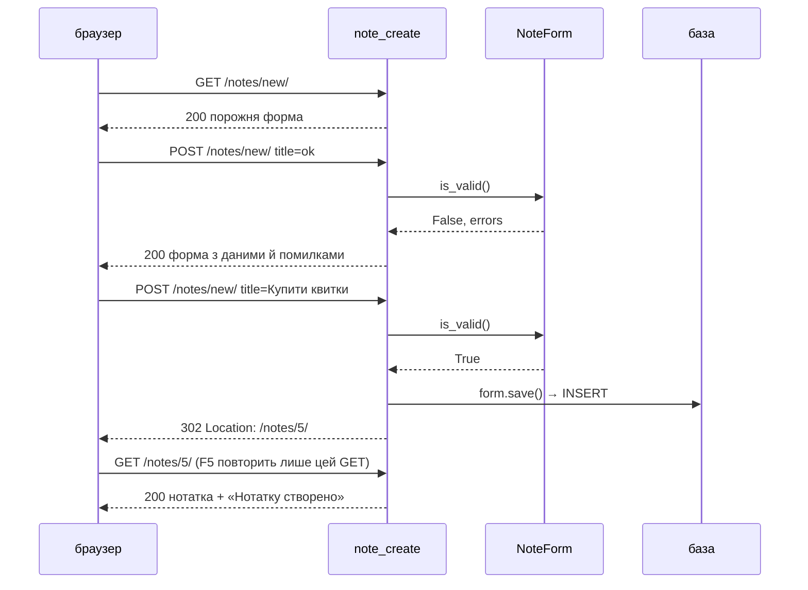
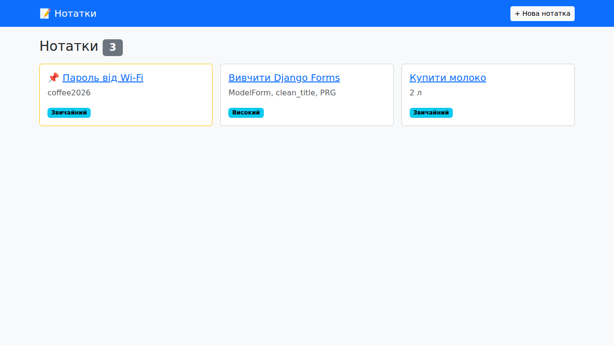
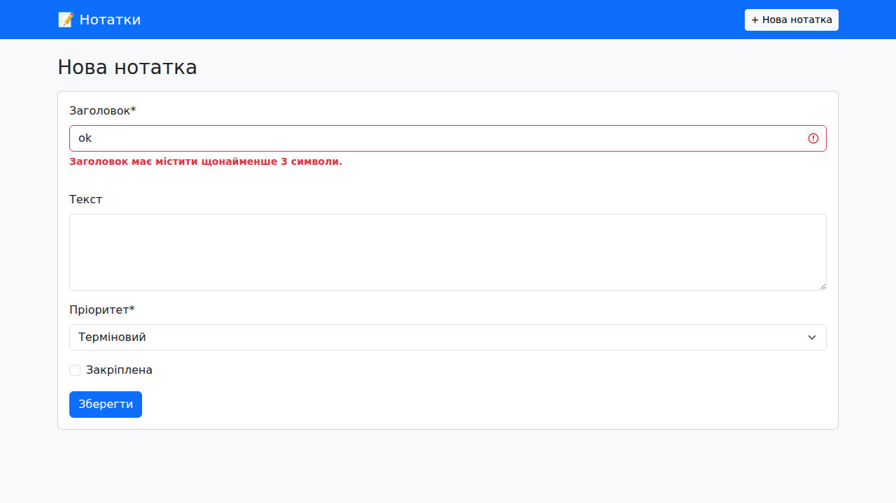
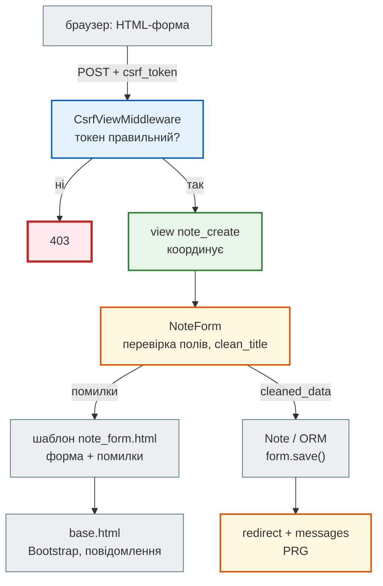

# Урок 34. Django: forms, HTML practice

В уроці 33 нотатки можна було створювати двома способами: в адмінці або в `python manage.py shell`. Обидва — для розробника й персоналу, а не для людей, які користуються сайтом. Звичайному користувачу потрібні **сторінки**: список нотаток, кнопка «Нова нотатка», форма, яка підкаже, що не так, кнопки «Редагувати» й «Видалити». І все це має виглядати охайно на телефоні й на ноутбуці.

Сьогодні робимо з `hello_project` справжній застосунок нотаток: HTML-форми, Django Forms з перевіркою даних, повний CRUD (Create, Read, Update, Delete), спільний шаблон сторінки з Bootstrap і повідомлення «Нотатку створено». Це кроки 2 і 4 маршруту Zero to Hero Django-книги.

**Що потрібно з попередніх уроків:** проєкт `hello_project`, модель `Note`, view, маршрути, шаблони (урок 33), HTTP-методи `GET` і `POST`, статус-коди, перенаправлення (уроки 31–32).

**Після уроку ти зможеш:**

- пояснити, що і як браузер надсилає з HTML-форми (`GET` чи `POST`, поля `name`, CSRF-токен);
- описати `ModelForm`, додати власну перевірку поля й вивести помилки поруч із полями;
- написати CRUD-views за шаблоном GET → POST → **redirect** (PRG) і повідомлення `messages`;
- побудувати сторінки на спільному `base.html` через `` / `` і Bootstrap 5;
- вивести форму одним рядком через django-crispy-forms;
- пояснити, чому видалення — лише `POST`, а після `POST` — завжди перенаправлення.

**Задача розділу.** CRUD нотаток зі сторінками `/notes/`, `/notes/new/`, `/notes/<id>/`, `…/edit/`, `…/delete/`. Повний приклад — у розділі [«Практика»](#practice).

**Ноутбук заняття:** [`note_lesson_34_forms.ipynb`](https://github.com/NikoriakViktot/PY-Course-Victor-Nikoriak-22-09-2026/blob/main/module_4/lessons/lesson_34_django_forms/note_lesson_34_forms.ipynb) [](https://colab.research.google.com/github/NikoriakViktot/PY-Course-Victor-Nikoriak-22-09-2026/blob/main/module_4/lessons/lesson_34_django_forms/note_lesson_34_forms.ipynb) — форми, валідація й CRUD з перевірками.

!!! info "Книга Django"
    Урок продовжує проєкт уроку 33 і відповідає крокам [2 «ModelForm і CRUD»](https://nikoriakviktot.github.io/notes_chat_app/tutorials/02_first_model/modelform_and_crud/) і [4 «Templates і Forms»](https://nikoriakviktot.github.io/notes_chat_app/tutorials/04_templates_and_forms/) маршруту Zero to Hero. Імена views, шаблонів і маршрутів — ті самі, що в книзі: код легко звіряти. Кожен розділ має посилання «Поглиблено» на розділ книги.

## Пригадай

1. Чим `GET` відрізняється від `POST`? Який з них можна безпечно повторити (урок 32)?
2. Що означає відповідь `302` і заголовок `Location` (урок 31)?
3. Як шаблон Django захищає від HTML у даних користувача (урок 33)?

??? success "Відповіді"

    1. `GET` читає і нічого не змінює — його можна повторювати, кешувати й класти в закладки. `POST` змінює дані на сервері; повтор створить дубль.
    2. «Шукай за іншою адресою»: браузер сам зробить `GET` на адресу з `Location`. Сьогодні це основа шаблону PRG.
    3. Автоекранування: `<script>` у заголовку нотатки виводиться як текст, а не виконується.

## HTML-форма: що надсилає браузер

**Форма** — HTML-елемент, який збирає введені дані й надсилає їх на сервер:

```html
<form method="post" action="/notes/new/">
  <input type="text" name="title" value="Купити квитки">
  <textarea name="content">Київ — Львів</textarea>
  <select name="priority"><option value="3" selected>Високий</option></select>
  <button type="submit">Зберегти</button>
</form>
```

| Атрибут | Що робить |
|---|---|
| `method="get"` | дані йдуть у **URL**: `/notes/?q=django` — для пошуку й фільтрів |
| `method="post"` | дані йдуть у **тілі** запиту — для створення, зміни, видалення |
| `action` | адреса, куди надіслати; без нього — поточна сторінка |
| `name` | **ключ** поля: на сервері це `request.POST["title"]`. Поле без `name` не надсилається |

Натиснувши «Зберегти», браузер надішле такий запит (тіло закодоване як `application/x-www-form-urlencoded`, пробіли — `+`, кирилиця — `%D0…`):

```text
POST /notes/new/ HTTP/1.1
Content-Type: application/x-www-form-urlencoded

title=%D0%9A%D1%83%D0%BF%D0%B8%D1%82%D0%B8+%D0%BA%D0%B2%D0%B8%D1%82%D0%BA%D0%B8&content=...&priority=3
```

Django розбирає тіло й кладе поля в словник `request.POST`. Але приймати їх напряму не можна: треба перевірити, що заголовок є, пріоритет — число від 1 до 4, і повернути людині зрозумілі помилки. Це робота **форм Django**.

!!! tip "Поглиблено"
    Книга: [HTML основи](https://nikoriakviktot.github.io/notes_chat_app/05_frontend_and_templates/html_basics_full/), [Django Forms](https://nikoriakviktot.github.io/notes_chat_app/04_forms_and_validation/django_forms_full/). MDN: [Sending form data](https://developer.mozilla.org/en-US/docs/Learn_web_development/Extensions/Forms/Sending_and_retrieving_form_data).

## ModelForm: форма з моделі

Беремо проєкт з уроку 33 і створюємо базу з його міграцій, суперкористувача й кілька нотаток:

```text
$ python manage.py migrate
Operations to perform:
  Apply all migrations: admin, auth, contenttypes, hello_app, sessions
Running migrations:
  Applying contenttypes.0001_initial... OK
  Applying auth.0001_initial... OK
  Applying admin.0001_initial... OK
  Applying admin.0002_logentry_remove_auto_add... OK
  Applying admin.0003_logentry_add_action_flag_choices... OK
  Applying contenttypes.0002_remove_content_type_name... OK
  Applying auth.0002_alter_permission_name_max_length... OK
  Applying auth.0003_alter_user_email_max_length... OK
  Applying auth.0004_alter_user_username_opts... OK
  Applying auth.0005_alter_user_last_login_null... OK
  Applying auth.0006_require_contenttypes_0002... OK
  Applying auth.0007_alter_validators_add_error_messages... OK
  Applying auth.0008_alter_user_username_max_length... OK
  Applying auth.0009_alter_user_last_name_max_length... OK
  Applying auth.0010_alter_group_name_max_length... OK
  Applying auth.0011_update_proxy_permissions... OK
  Applying auth.0012_alter_user_first_name_max_length... OK
  Applying hello_app.0001_initial... OK
  Applying hello_app.0002_alter_note_options_note_is_pinned... OK
  Applying hello_app.0003_note_priority... OK
  Applying sessions.0001_initial... OK
$ python manage.py createsuperuser --noinput --username admin --email admin@example.com
Superuser created successfully.
```

```python
from hello_app.models import Note

Note.objects.create(title="Купити молоко", content="2 л")
Note.objects.create(title="Вивчити Django Forms", content="ModelForm, clean_title, PRG", priority=3)
Note.objects.create(title="Пароль від Wi-Fi", content="coffee2026", is_pinned=True)
print(Note.objects.count())
```

```text
3
```

**`ModelForm`** будує поля форми з полів моделі — як `ModelSerializer` в уроці 35 будує поля API. Обмеження моделі (`max_length=200`, `choices` для пріоритету) стають перевірками форми самі:

```python title="hello_app/forms.py"
from django import forms

from .models import Note


class NoteForm(forms.ModelForm):
    class Meta:
        model = Note
        fields = ["title", "content", "priority", "is_pinned"]
        widgets = {"content": forms.Textarea(attrs={"rows": 4})}

    def __init__(self, *args, **kwargs):
        super().__init__(*args, **kwargs)
        for field in self.fields.values():          # класи Bootstrap для кожного поля
            widget = field.widget
            if isinstance(widget, forms.CheckboxInput):
                widget.attrs["class"] = "form-check-input"
            elif isinstance(widget, forms.Select):
                widget.attrs["class"] = "form-select"
            else:
                widget.attrs["class"] = "form-control"

    def clean_title(self):
        title = self.cleaned_data["title"].strip()
        if len(title) < 3:
            raise forms.ValidationError("Заголовок має містити щонайменше 3 символи.")
        return title
```

- `fields` — **явний** список полів. `created_at` у форму не потрапить: його ставить Django.
- `widgets` — як поле виглядає в HTML: для тексту — `<textarea>` на 4 рядки.
- `clean_<поле>()` — власна перевірка одного поля. Повертає **очищене** значення (тут без пробілів навколо).

Спробуємо форму в `python manage.py shell` — без браузера й сервера:

```python
from hello_app.forms import NoteForm

form = NoteForm(data={"title": "  Купити квитки  ", "content": "Київ — Львів", "priority": "3"})
print(form.is_valid())
print(form.cleaned_data)

bad = NoteForm(data={"title": "ok", "priority": "9"})
print(bad.is_valid())
for field, errors in bad.errors.items():
    print(field, "→", errors[0])
```

```text
True
{'title': 'Купити квитки', 'content': 'Київ — Львів', 'priority': 3, 'is_pinned': False}
False
title → Заголовок має містити щонайменше 3 символи.
priority → Зробить коректний вибір, 9 немає серед варіантів вибору.
```

- `data=` — те, що прийшло з браузера: **рядки** (`"3"`). Після `is_valid()` у `cleaned_data` — правильні типи: `3`, `False` для незазначеного прапорця.
- Помилки зібрано для всіх полів одразу, мовою з `LANGUAGE_CODE = "uk"`.
- `is_valid()` — **обов'язково перед** `cleaned_data` і `save()`.

Як форма виглядає в HTML? Одне поле — вже готовий тег з атрибутами з моделі:

```python
print(bad["title"])
print(bad["title"].errors)
print(NoteForm()["priority"])
```

```text
<input type="text" name="title" value="ok" maxlength="200" class="form-control" required aria-invalid="true" aria-describedby="id_title_error" id="id_title">
<ul class="errorlist" id="id_title_error"><li>Заголовок має містити щонайменше 3 символи.</li></ul>
<select name="priority" class="form-select" id="id_priority">
  <option value="1">Низький</option>

  <option value="2" selected>Звичайний</option>

  <option value="3">Високий</option>

  <option value="4">Терміновий</option>

</select>
```

- `maxlength="200"` і `required` — з моделі, `class="form-control"` — з нашого `__init__`.
- `aria-invalid="true"` і `aria-describedby` Django додав сам, бо в полі помилка: екранний читач озвучить її разом із полем.
- Помилки — список `<ul class="errorlist">`; список `<option>` — з `choices` пріоритету.
- Червону рамку Bootstrap (`is-invalid`) наш простий шаблон не додає — це зробить crispy-forms наприкінці уроку.

!!! tip "Поглиблено"
    Книга: [ModelForm і CRUD (крок 2)](https://nikoriakviktot.github.io/notes_chat_app/tutorials/02_first_model/modelform_and_crud/), [Еволюція форм (крок 4)](https://nikoriakviktot.github.io/notes_chat_app/tutorials/04_templates_and_forms/forms_evolution/), [Django Forms](https://nikoriakviktot.github.io/notes_chat_app/04_forms_and_validation/django_forms_full/).

## CRUD-views і шаблон PRG

Для кожної дії — своя view. Створення й редагування мають дві гілки: `GET` показує форму, `POST` перевіряє дані.

```python title="hello_app/views.py"
from django.contrib import messages
from django.http import HttpResponse
from django.shortcuts import get_object_or_404, redirect, render

from .forms import NoteForm
from .models import Note


def index(request):
    return redirect("hello_app:note_list")


def about(request):
    return HttpResponse("Це моя перша сторінка на Django!")


def note_list(request):
    return render(request, "hello_app/note_list.html", {"notes": Note.objects.all()})


def note_detail(request, pk):
    note = get_object_or_404(Note, pk=pk)
    return render(request, "hello_app/note_detail.html", {"note": note})


def note_create(request):
    if request.method == "POST":
        form = NoteForm(request.POST)
        if form.is_valid():
            note = form.save()
            messages.success(request, f"Нотатку «{note.title}» створено.")
            return redirect("hello_app:note_detail", pk=note.pk)
    else:
        form = NoteForm()
    return render(request, "hello_app/note_form.html", {"form": form, "heading": "Нова нотатка"})


def note_edit(request, pk):
    note = get_object_or_404(Note, pk=pk)
    if request.method == "POST":
        form = NoteForm(request.POST, instance=note)
        if form.is_valid():
            form.save()
            messages.success(request, "Зміни збережено.")
            return redirect("hello_app:note_detail", pk=note.pk)
    else:
        form = NoteForm(instance=note)
    return render(request, "hello_app/note_form.html", {"form": form, "heading": "Редагування", "note": note})


def note_delete(request, pk):
    note = get_object_or_404(Note, pk=pk)
    if request.method == "POST":
        note.delete()
        messages.info(request, f"Нотатку «{note.title}» видалено.")
        return redirect("hello_app:note_list")
    return render(request, "hello_app/note_confirm_delete.html", {"note": note})
```

- **`get_object_or_404`** — нотатки немає → сторінка `404`, а не `500` від `DoesNotExist`.
- **`instance=note`** — форма редагує існуючу нотатку: `GET` показує її поля, `form.save()` робить `UPDATE`, а не `INSERT`.
- **Неправильні дані** — `is_valid()` повертає `False`, і та сама `render(...)` унизу показує форму **з введеними даними й помилками**.
- **Правильні дані** — `redirect(...)`, а не `render(...)`. Це шаблон **PRG** — нижче.
- **`messages.success`** — повідомлення «на одну сторінку»: зберігається в сесії й показується на наступній сторінці після перенаправлення.
- **Видалення** — `GET` лише питає «Точно видалити?», видаляє тільки `POST`.

```python title="hello_app/urls.py"
from django.urls import path

from . import views

app_name = "hello_app"

urlpatterns = [
    path("", views.index, name="index"),
    path("about/", views.about, name="about"),
    path("notes/", views.note_list, name="note_list"),
    path("notes/new/", views.note_create, name="note_create"),
    path("notes/<int:pk>/", views.note_detail, name="note_detail"),
    path("notes/<int:pk>/edit/", views.note_edit, name="note_edit"),
    path("notes/<int:pk>/delete/", views.note_delete, name="note_delete"),
]
```

`<int:pk>` — **конвертер шляху**: частина адреси стає аргументом `pk` типу `int`. `/notes/abc/` навіть не дійде до view — `404`.

### PRG: Post / Redirect / Get

Чому після успішного `POST` — перенаправлення, а не одразу сторінка? Бо браузер пам'ятає **останній запит**. Якщо ним був `POST`, кнопка «Оновити» (F5) надішле форму ще раз — і з'явиться друга однакова нотатка. Після перенаправлення останній запит — `GET` сторінки нотатки, і оновлення нічого не ламає.



!!! tip "Поглиблено"
    Книга: [ModelForm і CRUD: PRG і Messages](https://nikoriakviktot.github.io/notes_chat_app/tutorials/02_first_model/modelform_and_crud/), [Views](https://nikoriakviktot.github.io/notes_chat_app/02_django_core/views_full/).

## Шаблони: base.html і Bootstrap

Усі сторінки мають однакову шапку, стилі й місце для повідомлень. Щоб не копіювати це в кожен шаблон, робимо **базовий** шаблон з **блоками**, а сторінки його **розширюють**:

```html title="hello_app/templates/base.html"
<!doctype html>
<html lang="uk">
<head>
  <meta charset="utf-8">
  <meta name="viewport" content="width=device-width, initial-scale=1">
  <title>Нотатки</title>
  <link rel="stylesheet" href="https://cdn.jsdelivr.net/npm/bootstrap@5.3.8/dist/css/bootstrap.min.css">
</head>
<body class="bg-light">
  <nav class="navbar navbar-dark bg-primary mb-4">
    <div class="container">
      <a class="navbar-brand" href="">📝 Нотатки</a>
      <a class="btn btn-light btn-sm" href="">+ Нова нотатка</a>
    </div>
  </nav>
  <main class="container">
    
      <div class="alert alert-{{ message.tags }}">{{ message }}</div>
    
    
  </main>
  <script src="https://cdn.jsdelivr.net/npm/bootstrap@5.3.8/dist/js/bootstrap.bundle.min.js"></script>
</body>
</html>
```

- `…` — «дірка», яку заповнить сторінка; вміст між тегами — значення за замовчуванням.
- `` — адреса за **ім'ям** маршруту: зміниш шлях в `urls.py` — посилання оновляться самі.
- `message.tags` — рівень повідомлення (`success`, `info`) збігається з класами Bootstrap `alert-success`, `alert-info`.
- Bootstrap підключено з CDN: жодних файлів у проєкті. Класи `container`, `navbar`, `btn`, `card`, `row`/`col` — його сітка й компоненти.

Сторінка списку розширює `base.html` і заповнює блоки:

```html title="hello_app/templates/hello_app/note_list.html"


Нотатки ({{ notes|length }})


<h1 class="h3 mb-3">Нотатки <span class="badge bg-secondary">{{ notes|length }}</span></h1>
<div class="row row-cols-1 row-cols-md-3 g-3">
  
    <div class="col">
      <div class="card h-100 border-warning">
        <div class="card-body">
          <h2 class="h5 card-title">
            📌
            <a href="">{{ note.title }}</a>
          </h2>
          <p class="card-text text-muted">{{ note.content|default:"без тексту"|truncatechars:80 }}</p>
          <span class="badge text-bg-info">{{ note.get_priority_display }}</span>
        </div>
      </div>
    </div>
  
    <p class="text-muted">Нотаток ще немає.</p>
  
</div>

```

`row-cols-1 row-cols-md-3` — сітка Bootstrap: на телефоні одна картка в рядку, від середнього екрана — три.

Сторінка нотатки і підтвердження видалення:

```html title="hello_app/templates/hello_app/note_detail.html"


{{ note.title }}


<nav class="mb-3"><a href="">← Усі нотатки</a></nav>
<h1 class="h3">📌 {{ note.title }}</h1>
<p class="text-muted">{{ note.get_priority_display }} · {{ note.created_at|date:"d.m.Y H:i" }}</p>
<p>{{ note.content|linebreaksbr|default:"без тексту" }}</p>
<a class="btn btn-primary" href="">Редагувати</a>
<a class="btn btn-outline-danger" href="">Видалити</a>

```

```html title="hello_app/templates/hello_app/note_confirm_delete.html"


Видалити «{{ note.title }}»


<h1 class="h4">Видалити нотатку «{{ note.title }}»?</h1>
<p class="text-muted">Цю дію не можна скасувати.</p>
<form method="post">
  
  <button type="submit" class="btn btn-danger">Так, видалити</button>
  <a class="btn btn-secondary" href="">Скасувати</a>
</form>

```

І форма — одна на створення й редагування. Поля виводимо циклом, помилки — під полем:

```html title="hello_app/templates/hello_app/note_form.html"


{{ heading }}


<h1 class="h3 mb-3">{{ heading }}</h1>
<form method="post" class="card card-body" novalidate>
  
  
    <div class="mb-3">
      <label class="form-label" for="{{ field.id_for_label }}">{{ field.label }}</label>
      {{ field }}
      <div class="text-danger small">{{ error }}</div>
    </div>
  
  <div><button type="submit" class="btn btn-primary">Зберегти</button></div>
</form>

```

- **``** — прихований `<input>` з токеном. Без нього Django відхилить `POST` (розділ нижче).
- **`novalidate`** — вимикає перевірку браузера (`required`), щоб на уроці бачити помилки **сервера**. Сервер перевіряє завжди: перевірку в браузері легко обійти.

Запускаємо сервер. Приклад виводу (дата й час у тебе інші):

```text
$ python manage.py runserver
Watching for file changes with StatReloader
Performing system checks...

System check identified no issues (0 silenced).
September 27, 2026 - 07:37:12
Django version 5.2.17, using settings 'hello_project.settings'
Starting development server at http://127.0.0.1:8000/
Quit the server with CONTROL-C.
```

```text
$ curl -s -o /dev/null -w "%{http_code} -> %{redirect_url}\n" http://127.0.0.1:8000/
302 -> http://127.0.0.1:8000/notes/
$ curl -s http://127.0.0.1:8000/notes/ | grep -o "<title>.*</title>"
<title>Нотатки (3)</title>
$ curl -s -o /dev/null -w "%{http_code}\n" http://127.0.0.1:8000/notes/99/
404
$ curl -s -o /dev/null -w "%{http_code}\n" http://127.0.0.1:8000/notes/abc/
404
```



!!! tip "Поглиблено"
    Книга: [Template Inheritance (крок 4)](https://nikoriakviktot.github.io/notes_chat_app/tutorials/04_templates_and_forms/template_inheritance/), [Bootstrap 5](https://nikoriakviktot.github.io/notes_chat_app/05_frontend_and_templates/bootstrap_5_full/), [Advanced Templates](https://nikoriakviktot.github.io/notes_chat_app/05_frontend_and_templates/advanced_templates_full/).

## CSRF: чому форма без токена не пройде

**CSRF** (Cross-Site Request Forgery) — атака, коли чужий сайт змушує твій браузер надіслати `POST` на сайт, де ти вже увійшов: «видалити все», «переказати гроші». Браузер сам додасть твої cookie, і запит виглядатиме справжнім.

Захист Django: кожна форма містить **секретний токен**, який знає лише справжня сторінка. `POST` без правильного токена відхиляється. Перевіримо `curl`, який токена не має:

```text
$ curl -s -o /dev/null -w "%{http_code}\n" -X POST -d "title=Хакерська нотатка" http://127.0.0.1:8000/notes/new/
403
```

`403 Forbidden` — і нотатка не створилась. Токен у сторінці форми виглядає так (значення щоразу інше):

```text
$ curl -s http://127.0.0.1:8000/notes/new/ | grep -o 'name="csrfmiddlewaretoken" value="[^"]\{8\}'
name="csrfmiddlewaretoken" value="Oh4Vg1X0
```

Приклад виводу вище: у тебе значення токена інше — він випадковий для кожної сесії.

## Повний цикл: тестовий клієнт

Пройдемо весь CRUD тестовим клієнтом Django — він надсилає запити у views без мережі, як браузер (CSRF за замовчуванням не перевіряє — так зручніше в тестах). Код views змінився, тому — **новий** `python manage.py shell`: старий пам'ятає старі модулі.

```python
from django.test import Client
from django.test.utils import setup_test_environment

from hello_app.models import Note

setup_test_environment()
client = Client()

bad = client.post("/notes/new/", {"title": "ok", "priority": "9"})
print(bad.status_code, dict(bad.context["form"].errors))

good = client.post("/notes/new/", {"title": "Купити квитки", "content": "Київ — Львів", "priority": "3"})
print(good.status_code, good["Location"])

page = client.get(good["Location"])
print([str(message) for message in page.context["messages"]])
print(page.content.decode().count("Купити квитки"))

again = client.get(good["Location"])
print("після оновлення сторінки:", [str(m) for m in again.context["messages"]], Note.objects.count())
```

```text
200 {'title': ['Заголовок має містити щонайменше 3 символи.'], 'priority': ['Зробить коректний вибір, 9 немає серед варіантів вибору.']}
302 /notes/4/
['Нотатку «Купити квитки» створено.']
3
після оновлення сторінки: [] 4
```

- Неправильні дані — `200` і та сама форма з помилками.
- Правильні — `302` на сторінку нотатки; там повідомлення «створено».
- Повторний `GET` (оновлення сторінки) не створює нотатку і вже не показує повідомлення: воно «на одну сторінку».

Редагування і видалення:

```python
note = Note.objects.get(title="Купити квитки")
edit = client.post(f"/notes/{note.pk}/edit/", {"title": "Купити квитки на потяг", "content": "Київ — Львів, 12:40", "priority": "4"})
note.refresh_from_db()
print(edit.status_code, note.title, note.get_priority_display())

confirm = client.get(f"/notes/{note.pk}/delete/")
print(confirm.status_code, Note.objects.filter(pk=note.pk).exists())
delete = client.post(f"/notes/{note.pk}/delete/")
print(delete.status_code, delete["Location"], Note.objects.filter(pk=note.pk).exists())
```

```text
302 Купити квитки на потяг Терміновий
200 True
302 /notes/ False
```

`GET` на `/delete/` лише показав сторінку підтвердження — нотатка на місці. Видалив її `POST`.

## django-crispy-forms: форма одним рядком

Цикл по полях у `note_form.html` і класи Bootstrap у `NoteForm.__init__` повторюватимуться в кожній формі. У Notes Chat App це робить **django-crispy-forms**: форма рендериться в розмітку Bootstrap 5 одним фільтром, разом з підсвіткою помилок.

```bash
pip install django-crispy-forms crispy-bootstrap5
```

```python title="hello_project/settings.py (фрагмент)"
INSTALLED_APPS = [
    "django.contrib.admin",
    "django.contrib.auth",
    "django.contrib.contenttypes",
    "django.contrib.sessions",
    "django.contrib.messages",
    "django.contrib.staticfiles",
    "crispy_forms",
    "crispy_bootstrap5",
    "hello_app",
]

CRISPY_ALLOWED_TEMPLATE_PACKS = "bootstrap5"

CRISPY_TEMPLATE_PACK = "bootstrap5"
```

Форма повертається до простого вигляду — класи Bootstrap тепер додає crispy:

```python title="hello_app/forms.py"
from django import forms

from .models import Note


class NoteForm(forms.ModelForm):
    class Meta:
        model = Note
        fields = ["title", "content", "priority", "is_pinned"]
        widgets = {"content": forms.Textarea(attrs={"rows": 4})}

    def clean_title(self):
        title = self.cleaned_data["title"].strip()
        if len(title) < 3:
            raise forms.ValidationError("Заголовок має містити щонайменше 3 символи.")
        return title
```

```html title="hello_app/templates/hello_app/note_form.html"



{{ heading }}


<h1 class="h3 mb-3">{{ heading }}</h1>
<form method="post" class="card card-body" novalidate>
  
  {{ form|crispy }}
  <div><button type="submit" class="btn btn-primary">Зберегти</button></div>
</form>

```

Відправимо форму з помилкою в браузері — crispy сам підсвітив поле червоним і показав помилку під ним:



!!! tip "Поглиблено"
    Книга: [Crispy Forms (крок 4)](https://nikoriakviktot.github.io/notes_chat_app/tutorials/04_templates_and_forms/crispy_forms/), [Crispy Forms детально](https://nikoriakviktot.github.io/notes_chat_app/04_forms_and_validation/crispy_forms_full/), [Компоненти](https://nikoriakviktot.github.io/notes_chat_app/tutorials/04_templates_and_forms/components/).

## Архітектура: де що живе { #architecture }



- **Перевірка даних — у формі, не у view.** View лише вирішує: форма правильна → зберегти й перенаправити; ні → показати знову. Та сама `NoteForm` працює і для створення, і для редагування.
- **Обмеження — в моделі.** `max_length` і `choices` форма бере з моделі; правила, які мають діяти й для адмінки, й для API (урок 35), кладемо в модель, а особливості саме цієї форми — у `clean_*`.
- **Шаблони — ієрархія.** `base.html` → сторінка. У Notes Chat App ієрархія глибша: `base.html` → макет з бічною панеллю → сторінка, плюс компоненти (``) — крок 4 книги.
- **Безпека з коробки:** CSRF-токен для кожного `POST`, автоекранування в шаблонах, `get_object_or_404`. Чого тут ще немає — **власника нотатки**: зараз будь-хто може редагувати будь-яку нотатку. Вхід і права — урок 40 (крок 5 книги).

## Практика { #practice }

### Розібраний приклад: пошук у списку

Користувачеві потрібен пошук нотаток за заголовком. Пошук нічого не змінює — тому форма з **`method="get"`**: запит потрапляє в адресу `/notes/?q=…`, його можна зберегти в закладках і надіслати іншому.

```python title="hello_app/forms.py"
from django import forms

from .models import Note


class NoteForm(forms.ModelForm):
    class Meta:
        model = Note
        fields = ["title", "content", "priority", "is_pinned"]
        widgets = {"content": forms.Textarea(attrs={"rows": 4})}

    def clean_title(self):
        title = self.cleaned_data["title"].strip()
        if len(title) < 3:
            raise forms.ValidationError("Заголовок має містити щонайменше 3 символи.")
        return title


class NoteSearchForm(forms.Form):
    q = forms.CharField(label="Пошук", required=False, max_length=100)
```

`forms.Form` — форма **без моделі**: поля описуємо самі. У view — з `request.GET`:

```python title="hello_app/views.py (фрагмент)"
from .forms import NoteForm, NoteSearchForm


def note_list(request):
    search = NoteSearchForm(request.GET)
    notes = Note.objects.all()
    if search.is_valid() and search.cleaned_data["q"]:
        notes = notes.filter(title__icontains=search.cleaned_data["q"])
    return render(request, "hello_app/note_list.html", {"notes": notes, "search": search})
```

Змінилися лише імпорт і `note_list`; файл повністю — у проєкті уроку. Перевіримо тестовим клієнтом у новому shell:

```python
from django.test import Client
from django.test.utils import setup_test_environment

setup_test_environment()
client = Client()
for query in ["django", "wi-fi", "zzz", ""]:
    response = client.get("/notes/", {"q": query})
    print(repr(query), "→", [note.title for note in response.context["notes"]])
```

```text
'django' → ['Вивчити Django Forms']
'wi-fi' → ['Пароль від Wi-Fi']
'zzz' → []
'' → ['Пароль від Wi-Fi', 'Вивчити Django Forms', 'Купити молоко']
```

- `required=False` — порожній пошук теж правильний: показуємо всі нотатки.
- Форма перевіряє й пошук: `max_length=100` не дасть надіслати мегабайт у `q`.
- Кирилиця в SQLite шукається з урахуванням регістру (урок 33) — «Wi-Fi» знайдено, бо латиниця.

У шаблоні списку — форма над картками (`value` зберігає введене після пошуку):

```html title="hello_app/templates/hello_app/note_list.html"


Нотатки ({{ notes|length }})


<h1 class="h3 mb-3">Нотатки <span class="badge bg-secondary">{{ notes|length }}</span></h1>
<form method="get" class="mb-3 d-flex gap-2">
  <input class="form-control" type="search" name="q" value="{{ search.q.value|default:'' }}" placeholder="Пошук за заголовком">
  <button class="btn btn-outline-primary" type="submit">Знайти</button>
</form>
<div class="row row-cols-1 row-cols-md-3 g-3">
  
    <div class="col">
      <div class="card h-100 border-warning">
        <div class="card-body">
          <h2 class="h5 card-title">
            📌
            <a href="">{{ note.title }}</a>
          </h2>
          <p class="card-text text-muted">{{ note.content|default:"без тексту"|truncatechars:80 }}</p>
          <span class="badge text-bg-info">{{ note.get_priority_display }}</span>
        </div>
      </div>
    </div>
  
    <p class="text-muted">Нічого не знайдено.</p>
  
</div>

```

### Зміни приклад: фільтр за пріоритетом

Додай у `NoteSearchForm` поле `priority` — випадний список «Будь-який» + чотири пріоритети — і фільтр у `note_list`.

**Критерії перевірки:**

- `/notes/?priority=3` — лише високий пріоритет; `/notes/?priority=` — усі;
- пошук і пріоритет працюють разом: `/notes/?q=django&priority=3`;
- `/notes/?priority=abc` не дає `500`: форма невалідна — показуємо всі нотатки без фільтра;
- вибране значення лишається вибраним після пошуку.

??? tip "Підказка"
    `forms.TypedChoiceField(choices=[("", "Будь-який")] + Note.PRIORITY_CHOICES, coerce=int, required=False, empty_value=None)`.

### Спробуй самостійно: блокнот у формі

Якщо в уроці 33 ти додав модель `Notebook`, додай поле `notebook` у `NoteForm` і зроби сторінку блокнота `/notebooks/<id>/` зі списком його нотаток.

**Критерії перевірки:**

- у формі нотатки — випадний список блокнотів (назви з `__str__` моделі `Notebook`), можна лишити порожнім;
- на сторінці нотатки видно назву блокнота з посиланням на нього;
- на сторінці блокнота — його нотатки (`notebook.notes.all()`) і кнопка «+ Нова нотатка в цьому блокноті», яка відкриває форму з уже вибраним блокнотом (`NoteForm(initial={"notebook": notebook})`).

### Знайди помилку

Колега написав створення нотатки коротше — без перенаправлення:

```python
from django.shortcuts import render
from django.test import RequestFactory

from hello_app.forms import NoteForm
from hello_app.models import Note


def note_create_buggy(request):
    form = NoteForm(request.POST or None)
    if request.method == "POST" and form.is_valid():
        form.save()
    return render(request, "hello_app/note_form.html", {"form": form, "heading": "Нова нотатка"})


factory = RequestFactory()
before = Note.objects.count()
for attempt in range(2):                     # користувач натиснув «Зберегти», потім F5
    request = factory.post("/notes/new/", {"title": "Оплатити інтернет", "priority": "2"})
    response = note_create_buggy(request)
    print("спроба", attempt + 1, "→", response.status_code)
print("нових нотаток:", Note.objects.count() - before)
```

```text
спроба 1 → 200
спроба 2 → 200
нових нотаток: 2
```

Що не так?

??? success "Відповідь"
    Після успішного `POST` view повертає сторінку (`200`), а не перенаправлення. Для браузера останній запит — `POST`, тож «Оновити» (F5) пропонує надіслати форму ще раз — і з'являється **друга однакова нотатка**. Так само подвійне натискання «Зберегти» на повільному з'єднанні.

    Виправлення — PRG: після `form.save()` — `return redirect("hello_app:note_detail", pk=note.pk)`, а повідомлення — через `messages`. Додатковий бонус: після перенаправлення форма не показує щойно збережені дані як «ще не збережені».

## Підсумок

| Поняття | Що запам'ятати |
|---|---|
| HTML-форма | `method="get"` — пошук і фільтри (дані в URL); `method="post"` — зміни (дані в тілі); ключ — атрибут `name` |
| `forms.Form` | форма без моделі; поля описуємо самі |
| `ModelForm` | поля й обмеження з моделі; `Meta.fields` — явно; `widgets` |
| Валідація | `is_valid()` → `cleaned_data`; `clean_<поле>()` повертає очищене значення; `form.errors` для кожного поля |
| CRUD-views | `get_object_or_404`; `NoteForm(request.POST, instance=note)`; `form.save()` |
| PRG | після успішного `POST` — `redirect`, інакше F5 повторить `POST` |
| `messages` | повідомлення на одну наступну сторінку; рівні = класи Bootstrap |
| Шаблони | `base.html` + ``; сторінки — ``; `` |
| `<int:pk>` | конвертер шляху: число → аргумент view; інше → 404 |
| CSRF | `` у кожній `POST`-формі; без токена — `403` |
| Видалення | сторінка підтвердження на `GET`, видалення лише на `POST` |
| Bootstrap 5 | CDN; `container`, `row`/`col`, `card`, `btn`, `alert`, `form-control` |
| crispy-forms | `{{ form|crispy }}` — розмітка Bootstrap і помилки одним фільтром |

### Самоперевірка

1. Коли форма має бути `method="get"`, а коли `method="post"`?
2. Навіщо `is_valid()` перед `cleaned_data`? Що буде в `cleaned_data["priority"]` для `"3"` з браузера?
3. Опиши шаблон PRG і проблему, яку він розв'язує.
4. Чому посилання «Видалити» веде на сторінку підтвердження, а не видаляє одразу?
5. Від якої атаки захищає `` і як?
6. Навіщо `get_object_or_404` замість `Note.objects.get(pk=pk)`?
7. Що дає `` і ``?

??? success "Відповіді"

    1. `GET` — коли запит лише читає: пошук, фільтри (адреса з параметрами, закладки). `POST` — коли змінює дані: створення, редагування, видалення.
    2. `is_valid()` запускає перевірки й наповнює `cleaned_data` правильними типами; до нього `cleaned_data` немає. `"3"` → `3` (число).
    3. Post / Redirect / Get: після успішного `POST` сервер відповідає `302`, браузер робить `GET`. Оновлення сторінки повторює лише `GET` — немає повторної відправки форми й дублів.
    4. `GET` не має змінювати дані: посилання відкривають пошукові роботи, попереднє завантаження браузера, розширення. Видалення — лише `POST` з CSRF-токеном.
    5. Від CSRF: чужий сайт не знає секретного токена сторінки, тож його підроблений `POST` Django відхилить з `403`.
    6. Для неіснуючої нотатки — сторінка `404`, а не `500` через `DoesNotExist`.
    7. Спільна розмітка (шапка, стилі, повідомлення) — в одному `base.html`; сторінка заповнює лише свої блоки.

### Що далі

- Ноутбук заняття: [`note_lesson_34_forms.ipynb`](https://github.com/NikoriakViktot/PY-Course-Victor-Nikoriak-22-09-2026/blob/main/module_4/lessons/lesson_34_django_forms/note_lesson_34_forms.ipynb) [](https://colab.research.google.com/github/NikoriakViktot/PY-Course-Victor-Nikoriak-22-09-2026/blob/main/module_4/lessons/lesson_34_django_forms/note_lesson_34_forms.ipynb) — форми, валідація, CRUD і PRG з перевірками.
- Проєкт уроку — [`hello_project`](https://github.com/NikoriakViktot/PY-Course-Victor-Nikoriak-22-09-2026/tree/main/module_4/lessons/lesson_34_django_forms/hello_project) з CRUD, crispy-forms, пошуком і тестами.
- Урок 35 — REST API до тих самих нотаток (DRF). Урок 40 — вхід, власник нотатки й права (крок 5 книги).
- Книга: [контрольна точка кроку 4](https://nikoriakviktot.github.io/notes_chat_app/tutorials/04_templates_and_forms/checkpoint/).

## Документація і джерела

- Django: [Working with forms](https://docs.djangoproject.com/en/5.2/topics/forms/), [ModelForm](https://docs.djangoproject.com/en/5.2/topics/forms/modelforms/), [Form and field validation](https://docs.djangoproject.com/en/5.2/ref/forms/validation/), [The messages framework](https://docs.djangoproject.com/en/5.2/ref/contrib/messages/), [Template inheritance](https://docs.djangoproject.com/en/5.2/ref/templates/language/#template-inheritance), [CSRF protection](https://docs.djangoproject.com/en/5.2/ref/csrf/), [Shortcuts: `get_object_or_404`, `redirect`](https://docs.djangoproject.com/en/5.2/topics/http/shortcuts/), [URL path converters](https://docs.djangoproject.com/en/5.2/topics/http/urls/#path-converters)
- [Bootstrap 5.3](https://getbootstrap.com/docs/5.3/getting-started/introduction/), [django-crispy-forms](https://django-crispy-forms.readthedocs.io/) і [crispy-bootstrap5](https://github.com/django-crispy-forms/crispy-bootstrap5)
- MDN: [Web forms](https://developer.mozilla.org/en-US/docs/Learn_web_development/Extensions/Forms), [Post/Redirect/Get](https://en.wikipedia.org/wiki/Post/Redirect/Get) (Wikipedia)
- Django-книга: [ModelForm і CRUD](https://nikoriakviktot.github.io/notes_chat_app/tutorials/02_first_model/modelform_and_crud/), [крок 4: Templates і Forms](https://nikoriakviktot.github.io/notes_chat_app/tutorials/04_templates_and_forms/), [Django Forms](https://nikoriakviktot.github.io/notes_chat_app/04_forms_and_validation/django_forms_full/)
