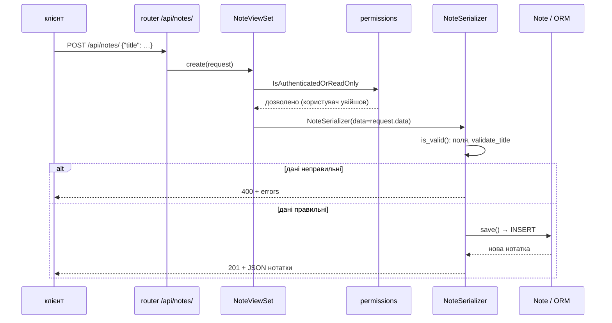
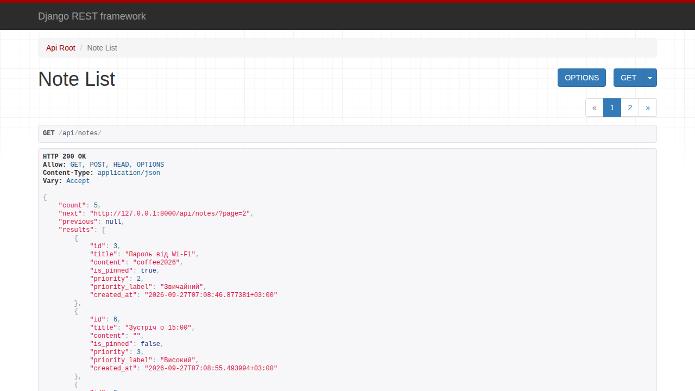
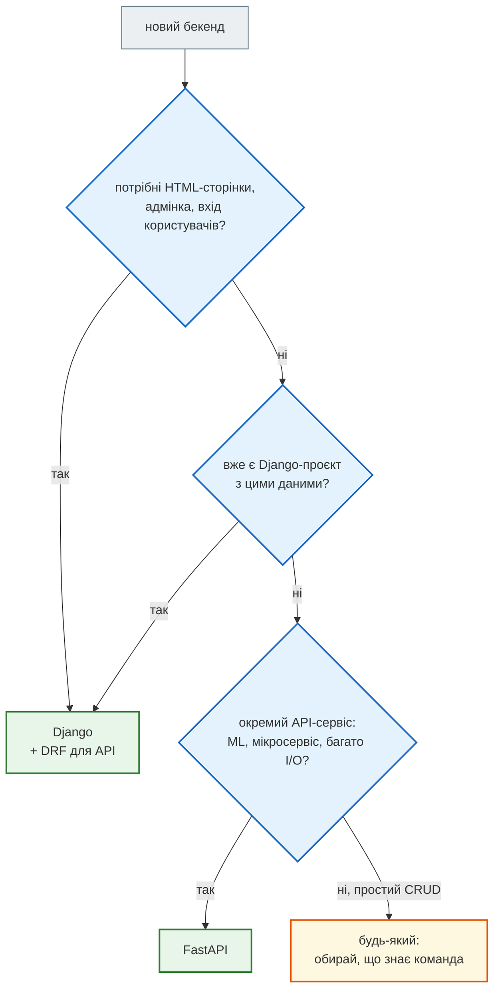
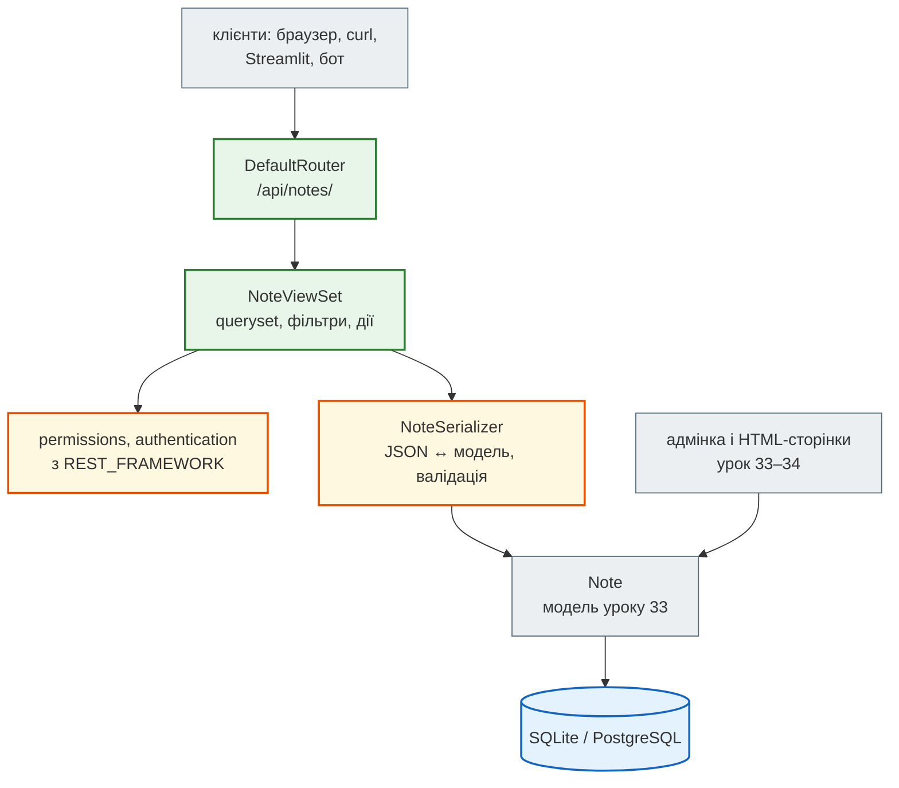

# Урок 35. DRF overview + Django vs FastAPI

У застосунку нотаток з уроку 33 є сторінки для людей і адмінка. Але нотатки потрібні й **програмам**: мобільному застосунку, Streamlit-дашборду, Telegram-боту (урок 47). Їм не потрібен HTML — їм потрібен JSON і REST API, як у метео-сервісу з уроку 32.

Писати API на «голому» Django можна, але довелося б самому перетворювати моделі на JSON, розбирати тіло запиту, перевіряти дані, повертати правильні коди. Усе це вже зроблено в **Django REST Framework** (DRF) — найпопулярнішому пакеті для API на Django. Сьогодні додамо API до нотаток, а наприкінці порівняємо Django + DRF із FastAPI, на якому ми писали Meteo API.

**Що потрібно з попередніх уроків:** Django-проєкт `hello_project`, модель `Note`, ORM, адмінка (урок 33), REST: ресурси, методи, коди, пагінація (урок 32), `requests` і `curl` (урок 31).

**Після уроку ти зможеш:**

- підключити DRF до Django-проєкту й налаштувати його в `settings.py`;
- описати **серіалізатор**: модель ↔ JSON, валідація вхідних даних, поля лише для читання;
- побудувати CRUD API на `ModelViewSet` і роутері, з пагінацією, фільтрами й власною дією;
- обмежити запис автентифікованим користувачам;
- отримати OpenAPI-схему API;
- порівняти Django + DRF і FastAPI і обрати інструмент під задачу.

**Задача розділу.** API нотаток `/api/notes/`: список, фільтри, створення, зміна, видалення, «закріпити». Повний приклад — у розділі [«Практика»](#practice).

**Ноутбук заняття:** [`note_lesson_35_drf.ipynb`](https://github.com/NikoriakViktot/PY-Course-Victor-Nikoriak-22-09-2026/blob/main/module_4/lessons/lesson_35_drf_fastapi/note_lesson_35_drf.ipynb) [](https://colab.research.google.com/github/NikoriakViktot/PY-Course-Victor-Nikoriak-22-09-2026/blob/main/module_4/lessons/lesson_35_drf_fastapi/note_lesson_35_drf.ipynb) — серіалізатори й API з перевірками прямо в ноутбуці.

!!! info "Місце в системі"
    Це продовження проєкту [`hello_project`](https://github.com/NikoriakViktot/PY-Course-Victor-Nikoriak-22-09-2026/tree/main/module_4/lessons/lesson_33_django_intro/hello_project) з уроку 33 — застосунку нотаток, що виросте до [Notes Chat App](https://github.com/NikoriakViktot/notes_chat_app). У маршруті [Zero to Hero](https://nikoriakviktot.github.io/notes_chat_app/tutorials/) Django-книги окремого кроку про API немає: цей урок його додає. Архітектурний погляд на серіалізатори (Input/Output-серіалізатори, сервіси) — у матеріалі викладача [Django Serializers — Transport Layer](https://github.com/NikoriakViktot/PY-Course-Victor-Nikoriak-23_02/blob/main/module_5/lesson_Django_Network_Architecture/DJANGO_SERIALIZERS.md).

## Пригадай

1. Який код повертає REST API, коли створено ресурс? Коли дані не пройшли перевірку (урок 32)?
2. Що повертає `Note.objects.filter(...)` і коли йде запит у базу (урок 33)?
3. Чим `PATCH` відрізняється від `PUT`?

??? success "Відповіді"

    1. `201 Created` (+ `Location`). Для неправильних даних у Meteo API був `422`; DRF за замовчуванням повертає `400 Bad Request` — обидва варіанти поширені, головне — однаково в усьому API.
    2. Лінивий QuerySet; SQL іде, коли потрібні дані.
    3. `PATCH` змінює передані поля, `PUT` замінює ресурс цілком.

## Підключення DRF

Беремо проєкт з уроку 33 і встановлюємо два пакети: сам DRF і `drf-spectacular` — генератор OpenAPI-схеми:

```bash
pip install djangorestframework drf-spectacular
```

```text
$ python -c "import rest_framework, drf_spectacular; print(rest_framework.VERSION, drf_spectacular.__version__)"
3.18.1 0.30.0
```

Обидва — Django-застосунки, тож додаємо їх в `INSTALLED_APPS`, а налаштування DRF збираємо в одному словнику `REST_FRAMEWORK`:

```python title="hello_project/settings.py (фрагмент)"
INSTALLED_APPS = [
    "django.contrib.admin",
    "django.contrib.auth",
    "django.contrib.contenttypes",
    "django.contrib.sessions",
    "django.contrib.messages",
    "django.contrib.staticfiles",
    "rest_framework",
    "drf_spectacular",
    "hello_app",
]

REST_FRAMEWORK = {
    "DEFAULT_PAGINATION_CLASS": "rest_framework.pagination.PageNumberPagination",
    "PAGE_SIZE": 3,
    "DEFAULT_AUTHENTICATION_CLASSES": [
        "rest_framework.authentication.SessionAuthentication",
        "rest_framework.authentication.BasicAuthentication",
    ],
    "DEFAULT_PERMISSION_CLASSES": ["rest_framework.permissions.IsAuthenticatedOrReadOnly"],
    "DEFAULT_SCHEMA_CLASS": "drf_spectacular.openapi.AutoSchema",
}

SPECTACULAR_SETTINGS = {"TITLE": "Notes API", "VERSION": "1.0.0"}
```

| Налаштування | Що дає |
|---|---|
| `PageNumberPagination`, `PAGE_SIZE: 3` | кожен список — сторінками по 3 записи: `?page=2` |
| `SessionAuthentication` | вхід через сесію браузера — як в адмінці |
| `BasicAuthentication` | логін і пароль у заголовку `Authorization` — зручно для `curl` (у production — лише через HTTPS, а частіше токени, урок 40) |
| `IsAuthenticatedOrReadOnly` | читати може будь-хто, змінювати — лише користувач, що увійшов |
| `AutoSchema` від drf-spectacular | OpenAPI-схема з коду, як у FastAPI |

Створимо базу з міграцій уроку 33, суперкористувача і кілька нотаток:

```text
$ python manage.py migrate
Operations to perform:
  Apply all migrations: admin, auth, contenttypes, hello_app, sessions
Running migrations:
  Applying contenttypes.0001_initial... OK
  Applying auth.0001_initial... OK
  Applying admin.0001_initial... OK
  Applying admin.0002_logentry_remove_auto_add... OK
  Applying admin.0003_logentry_add_action_flag_choices... OK
  Applying contenttypes.0002_remove_content_type_name... OK
  Applying auth.0002_alter_permission_name_max_length... OK
  Applying auth.0003_alter_user_email_max_length... OK
  Applying auth.0004_alter_user_username_opts... OK
  Applying auth.0005_alter_user_last_login_null... OK
  Applying auth.0006_require_contenttypes_0002... OK
  Applying auth.0007_alter_validators_add_error_messages... OK
  Applying auth.0008_alter_user_username_max_length... OK
  Applying auth.0009_alter_user_last_name_max_length... OK
  Applying auth.0010_alter_group_name_max_length... OK
  Applying auth.0011_update_proxy_permissions... OK
  Applying auth.0012_alter_user_first_name_max_length... OK
  Applying hello_app.0001_initial... OK
  Applying hello_app.0002_alter_note_options_note_is_pinned... OK
  Applying hello_app.0003_note_priority... OK
  Applying sessions.0001_initial... OK
$ python manage.py createsuperuser --noinput --username admin --email admin@example.com
Superuser created successfully.
```

```python
from hello_app.models import Note

Note.objects.create(title="Купити молоко", content="2 л")
Note.objects.create(title="Вивчити DRF", content="serializers, viewsets", priority=3)
Note.objects.create(title="Пароль від Wi-Fi", content="coffee2026", is_pinned=True)
Note.objects.create(title="Ідея: бот для нотаток", priority=1)
print(Note.objects.count())
```

```text
4
```

## Серіалізатор: модель ↔ JSON

**Серіалізатор** робить дві роботи:

- **серіалізація** — об'єкт моделі → словник → JSON для відповіді;
- **десеріалізація** — JSON із запиту → перевірка → дані для збереження в модель.

`ModelSerializer` бере поля й обмеження прямо з моделі — як `ModelForm` для HTML-форм (урок 34):

```python title="hello_app/serializers.py"
from rest_framework import serializers

from .models import Note


class NoteSerializer(serializers.ModelSerializer):
    priority_label = serializers.CharField(source="get_priority_display", read_only=True)

    class Meta:
        model = Note
        fields = ["id", "title", "content", "is_pinned", "priority", "priority_label", "created_at"]
        read_only_fields = ["id", "created_at"]

    def validate_title(self, value):
        value = value.strip()
        if len(value) < 3:
            raise serializers.ValidationError("Заголовок має містити щонайменше 3 символи.")
        return value
```

- `fields` — **явний** список полів у JSON. Що не в списку — не потрапить у відповідь і не прийметься із запиту.
- `read_only_fields` — поля лише для відповіді: `id` і час створення клієнт не задає.
- `priority_label` — обчислене поле: `source` вказує на метод моделі `get_priority_display()` (урок 33).
- `validate_<поле>` — власна перевірка одного поля; повертає очищене значення.

Спробуємо в `python manage.py shell`. Серіалізація:

```python
from hello_app.models import Note
from hello_app.serializers import NoteSerializer

note = Note.objects.get(title="Вивчити DRF")
data = NoteSerializer(note).data
print(data)
print(NoteSerializer(Note.objects.filter(is_pinned=True), many=True).data)
```

Приклад виводу (час `created_at` у тебе інший):

```text
{'id': 2, 'title': 'Вивчити DRF', 'content': 'serializers, viewsets', 'is_pinned': False, 'priority': 3, 'priority_label': 'Високий', 'created_at': '2026-09-27T07:08:46.876031+03:00'}
[{'id': 3, 'title': 'Пароль від Wi-Fi', 'content': 'coffee2026', 'is_pinned': True, 'priority': 2, 'priority_label': 'Звичайний', 'created_at': '2026-09-27T07:08:46.877381+03:00'}]
```

`many=True` — серіалізувати колекцію (QuerySet або список). Результат — звичайні словники, які DRF перетворить на JSON.

Десеріалізація і валідація — **спершу `is_valid()`**, лише потім `save()`:

```python
good = NoteSerializer(data={"title": "  Прочитати про REST  ", "priority": 4, "id": 999})
print(good.is_valid(), good.validated_data)
created = good.save()
print(created.id, repr(created.title), created.get_priority_display())

bad = NoteSerializer(data={"title": "ok", "priority": 7})
print(bad.is_valid())
print(bad.errors)
```

```text
True {'title': 'Прочитати про REST', 'priority': 4}
5 'Прочитати про REST' Терміновий
False
{'title': [ErrorDetail(string='Заголовок має містити щонайменше 3 символи.', code='invalid')], 'priority': [ErrorDetail(string='"7" не є коректним вибором.', code='invalid_choice')]}
```

- `id: 999` у вхідних даних **проігноровано**: поле лише для читання. Інакше клієнт міг би перезаписати чужу нотатку.
- Пробіли навколо заголовка прибрав `validate_title`.
- Помилки зібрано **для всіх полів одразу** — клієнт виправить усе за один раз. Мова повідомлень — з `LANGUAGE_CODE = "uk"`.

!!! tip "Поглиблено"
    Порядок валідації, Input/Output-серіалізатори й перетворення помилок домену на HTTP-коди — [Django Serializers — Transport Layer](https://github.com/NikoriakViktot/PY-Course-Victor-Nikoriak-23_02/blob/main/module_5/lesson_Django_Network_Architecture/DJANGO_SERIALIZERS.md) (матеріал викладача); [DRF: Serializers](https://www.django-rest-framework.org/api-guide/serializers/).

## ViewSet і роутер: CRUD одним класом

У DRF є три рівні view — від ручного до автоматичного:

| Рівень | Приклад | Коли |
|---|---|---|
| `APIView` / `@api_view` | методи `get`, `post` пишемо самі | нестандартна логіка, один-два ендпоінти |
| generic views | `ListCreateAPIView`, `RetrieveUpdateDestroyAPIView` | стандартний CRUD, але окремими класами |
| **`ModelViewSet` + роутер** | один клас → усі 5 операцій, роутер сам будує адреси | ресурс з повним CRUD — як наші нотатки |

```python title="hello_app/api.py"
from rest_framework import viewsets

from .models import Note
from .serializers import NoteSerializer


class NoteViewSet(viewsets.ModelViewSet):
    queryset = Note.objects.all()
    serializer_class = NoteSerializer
```

Два рядки — і в нас список, створення, одна нотатка, зміна, заміна й видалення. Роутер перетворює ViewSet на маршрути:

```python title="hello_project/urls.py"
from django.contrib import admin
from django.urls import include, path
from drf_spectacular.views import SpectacularAPIView
from rest_framework.routers import DefaultRouter

from hello_app.api import NoteViewSet

router = DefaultRouter()
router.register("notes", NoteViewSet, basename="note")

urlpatterns = [
    path("admin/", admin.site.urls),
    path("api/", include(router.urls)),
    path("api/schema/", SpectacularAPIView.as_view(), name="schema"),
    path("", include("hello_app.urls")),
]
```

| Запит | Метод ViewSet | Що робить |
|---|---|---|
| `GET /api/notes/` | `list` | список (сторінками) |
| `POST /api/notes/` | `create` | створити → `201` |
| `GET /api/notes/{id}/` | `retrieve` | одна нотатка |
| `PUT /api/notes/{id}/` | `update` | замінити цілком |
| `PATCH /api/notes/{id}/` | `partial_update` | змінити частину |
| `DELETE /api/notes/{id}/` | `destroy` | видалити → `204` |



### API в роботі

Запускаємо сервер (в окремому терміналі) і пробуємо API через `curl`. `python -m json.tool --no-ensure-ascii` лише гарно форматує JSON і показує кирилицю як є.

Приклад виводу (дата й час у тебе інші):

```text
$ python manage.py runserver
Watching for file changes with StatReloader
Performing system checks...

System check identified no issues (0 silenced).
September 27, 2026 - 07:08:47
Django version 5.2.17, using settings 'hello_project.settings'
Starting development server at http://127.0.0.1:8000/
Quit the server with CONTROL-C.
```

Приклад виводу (тут і далі час `created_at` у тебе інший):

```text
$ curl -s "http://127.0.0.1:8000/api/notes/" | python -m json.tool --no-ensure-ascii
{
    "count": 5,
    "next": "http://127.0.0.1:8000/api/notes/?page=2",
    "previous": null,
    "results": [
        {
            "id": 3,
            "title": "Пароль від Wi-Fi",
            "content": "coffee2026",
            "is_pinned": true,
            "priority": 2,
            "priority_label": "Звичайний",
            "created_at": "2026-09-27T07:08:46.877381+03:00"
        },
        {
            "id": 5,
            "title": "Прочитати про REST",
            "content": "",
            "is_pinned": false,
            "priority": 4,
            "priority_label": "Терміновий",
            "created_at": "2026-09-27T07:08:47.014036+03:00"
        },
        {
            "id": 4,
            "title": "Ідея: бот для нотаток",
            "content": "",
            "is_pinned": false,
            "priority": 1,
            "priority_label": "Низький",
            "created_at": "2026-09-27T07:08:46.878745+03:00"
        }
    ]
}
```

Відповідь — сторінка: `count` — скільки всього, `next` / `previous` — посилання на сусідні сторінки, `results` — нотатки. Як у Meteo API уроку 32, тільки назви полів інші. Порядок — з `Meta.ordering` моделі: закріплені першими.

Читати може будь-хто, а **змінювати** — лише користувач, що увійшов:

```text
$ curl -s -X POST http://127.0.0.1:8000/api/notes/ -H "Content-Type: application/json" -d '{"title": "Без входу"}' -w "\n%{http_code}\n"
{"detail":"Реквізити перевірки достовірності не надані."}
403
$ curl -s -u admin:lesson33-pass -X POST http://127.0.0.1:8000/api/notes/ -H "Content-Type: application/json" -d '{"title": "Зустріч о 15:00", "priority": 3}' -w "\n%{http_code}\n"
{"id":6,"title":"Зустріч о 15:00","content":"","is_pinned":false,"priority":3,"priority_label":"Високий","created_at":"2026-09-27T07:08:55.493994+03:00"}
201
$ curl -s -u admin:lesson33-pass -X POST http://127.0.0.1:8000/api/notes/ -H "Content-Type: application/json" -d '{"title": "ok", "priority": 9}' -w "\n%{http_code}\n"
{"title":["Заголовок має містити щонайменше 3 символи."],"priority":["\"9\" не є коректним вибором."]}
400
```

- `403` без логіна: «Реквізити перевірки достовірності не надані» — облікових даних немає. `401` DRF повертає, лише коли **перший** клас у `DEFAULT_AUTHENTICATION_CLASSES` уміє попросити облікові дані заголовком `WWW-Authenticate` (як `BasicAuthentication`). У нас першою стоїть сесійна автентифікація, тому `403`. Переставиш класи місцями — отримаєш `401`.
- `-u admin:пароль` — Basic-автентифікація: `curl` сам додає заголовок `Authorization: Basic …`.
- `400` — перевірка серіалізатора; тіло пояснює кожне поле.

Зміна, видалення і неіснуюча нотатка:

```text
$ curl -s -u admin:lesson33-pass -X PATCH http://127.0.0.1:8000/api/notes/1/ -H "Content-Type: application/json" -d '{"content": "2 л і хліб"}'
{"id":1,"title":"Купити молоко","content":"2 л і хліб","is_pinned":false,"priority":2,"priority_label":"Звичайний","created_at":"2026-09-27T07:08:46.873207+03:00"}
$ curl -s -u admin:lesson33-pass -X DELETE http://127.0.0.1:8000/api/notes/4/ -o /dev/null -w "%{http_code}\n"
204
$ curl -s http://127.0.0.1:8000/api/notes/4/ -w "\n%{http_code}\n"
{"detail":"No Note matches the given query."}
404
```

### Browsable API

Відкрий `http://127.0.0.1:8000/api/notes/` у **браузері** — DRF замість сирого JSON покаже HTML-сторінку: відповідь, заголовки, посилання на сторінки, а після входу — форму для `POST`. Це та сама відповідь, просто для людини (DRF дивиться на заголовок `Accept` браузера):



### OpenAPI-схема

drf-spectacular будує опис API за стандартом OpenAPI з ViewSet і серіалізаторів — те саме, що FastAPI робить сам (урок 32):

```text
$ curl -s http://127.0.0.1:8000/api/schema/ | head -n 12
openapi: 3.0.3
info:
  title: Notes API
  version: 1.0.0
paths:
  /api/notes/:
    get:
      operationId: notes_list
      parameters:
      - name: page
        required: false
        in: query
$ curl -s http://127.0.0.1:8000/api/schema/ | grep -E "^  /api/"
  /api/notes/:
  /api/notes/{id}/:
  /api/schema/:
```

Схема у форматі YAML. З неї Swagger UI будує інтерактивну документацію (`SpectacularSwaggerView`), а Postman імпортує всі запити (урок 37).

!!! tip "Поглиблено"
    [DRF: ViewSets](https://www.django-rest-framework.org/api-guide/viewsets/), [Routers](https://www.django-rest-framework.org/api-guide/routers/), [Generic views](https://www.django-rest-framework.org/api-guide/generic-views/), [Permissions](https://www.django-rest-framework.org/api-guide/permissions/), [Pagination](https://www.django-rest-framework.org/api-guide/pagination/), [drf-spectacular](https://drf-spectacular.readthedocs.io/).

## Тести API

DRF має `APITestCase` і `APIClient` — тестовий клієнт, як у Django, але з JSON і автентифікацією. Тести отримують **окрему** тестову базу, яка створюється й видаляється сама (урок 41):

```python title="hello_app/tests_api.py"
from django.contrib.auth.models import User
from rest_framework import status
from rest_framework.test import APITestCase

from .models import Note


class NoteApiTests(APITestCase):
    def setUp(self):
        self.user = User.objects.create_user("alice", password="alice-pass")
        Note.objects.create(title="Перша нотатка")

    def test_list_is_public(self):
        response = self.client.get("/api/notes/")
        self.assertEqual(response.status_code, status.HTTP_200_OK)
        self.assertEqual(response.data["count"], 1)

    def test_create_requires_login(self):
        response = self.client.post("/api/notes/", {"title": "Без входу"}, format="json")
        self.assertEqual(response.status_code, status.HTTP_403_FORBIDDEN)

    def test_create_and_validation(self):
        self.client.force_authenticate(self.user)
        created = self.client.post("/api/notes/", {"title": "Нова", "priority": 4}, format="json")
        self.assertEqual(created.status_code, status.HTTP_201_CREATED)
        self.assertEqual(created.data["priority_label"], "Терміновий")
        bad = self.client.post("/api/notes/", {"title": "x"}, format="json")
        self.assertEqual(bad.status_code, status.HTTP_400_BAD_REQUEST)
        self.assertIn("title", bad.data)
```

Приклад виводу (час виконання у тебе інший):

```text
$ python manage.py test hello_app
Found 6 test(s).
System check identified no issues (0 silenced).
Creating test database for alias 'default'...
......
----------------------------------------------------------------------
Ran 6 tests in 0.684s

OK
Destroying test database for alias 'default'...
```

## Django + DRF чи FastAPI { #architecture }

Той самий API нотаток на FastAPI — для порівняння. Дані тут у словнику в пам'яті: база даних для FastAPI (SQLAlchemy / SQLModel) — урок 38.

```python title="fastapi_notes.py"
from datetime import datetime, timezone
from typing import Optional

from fastapi import FastAPI, HTTPException, Response
from pydantic import BaseModel, Field, field_validator

app = FastAPI(title="Notes API (FastAPI)")
NOTES: dict[int, dict] = {}


class NoteIn(BaseModel):
    title: str
    content: str = ""
    is_pinned: bool = False
    priority: int = Field(2, ge=1, le=4)

    @field_validator("title")
    @classmethod
    def title_min_length(cls, value):
        value = value.strip()
        if len(value) < 3:
            raise ValueError("Заголовок має містити щонайменше 3 символи.")
        return value


class NotePatch(BaseModel):
    title: Optional[str] = None
    content: Optional[str] = None
    is_pinned: Optional[bool] = None
    priority: Optional[int] = Field(None, ge=1, le=4)


@app.get("/api/notes/")
def list_notes(page: int = 1, size: int = 3):
    items = sorted(NOTES.values(), key=lambda n: (not n["is_pinned"], n["id"]))
    return {"count": len(items), "results": items[(page - 1) * size:page * size]}


@app.post("/api/notes/", status_code=201)
def create_note(body: NoteIn):
    note_id = max(NOTES, default=0) + 1
    NOTES[note_id] = {"id": note_id, **body.model_dump(), "created_at": datetime.now(timezone.utc)}
    return NOTES[note_id]


@app.get("/api/notes/{note_id}/")
def get_note(note_id: int):
    if note_id not in NOTES:
        raise HTTPException(404, "Не знайдено.")
    return NOTES[note_id]


@app.patch("/api/notes/{note_id}/")
def patch_note(note_id: int, body: NotePatch):
    note = get_note(note_id)
    note.update(body.model_dump(exclude_unset=True))
    return note


@app.delete("/api/notes/{note_id}/", status_code=204)
def delete_note(note_id: int):
    get_note(note_id)
    del NOTES[note_id]
    return Response(status_code=204)
```

Перевіримо тестовим клієнтом FastAPI — ті самі запити, що й до DRF:

```python
from fastapi.testclient import TestClient

from fastapi_notes import app

client = TestClient(app)
print(client.post("/api/notes/", json={"title": "Вивчити FastAPI", "priority": 3}).status_code)
bad = client.post("/api/notes/", json={"title": "ok", "priority": 9})
print(bad.status_code, [(e["loc"][-1], e["msg"]) for e in bad.json()["detail"]])
print(client.get("/api/notes/").json()["count"], client.get("/api/notes/7/").status_code)
print(sorted(path for path in app.openapi()["paths"]))
```

```text
201
422 [('title', 'Value error, Заголовок має містити щонайменше 3 символи.'), ('priority', 'Input should be less than or equal to 4')]
1 404
['/api/notes/', '/api/notes/{note_id}/']
```

| | Django + DRF | FastAPI |
|---|---|---|
| Що це | повний вебфреймворк + пакет для API | мікрофреймворк для API |
| База даних | вбудований ORM + міграції | обираєш сам: SQLAlchemy / SQLModel + Alembic (урок 38) |
| Валідація | серіалізатори (DRF) | Pydantic-моделі за анотаціями типів (урок 36) |
| CRUD | `ModelViewSet` + роутер — кілька рядків | кожен ендпоінт — окрема функція |
| Адмінка, auth, сесії | є з коробки | немає: окремі пакети або свій код |
| Документація API | drf-spectacular (пакет) | `/docs` з коробки |
| Помилка валідації | `400`, помилки за полями | `422`, список `detail` з `loc` |
| Async | частково (Django async views, урок 45) | від початку async (урок 27) |
| Швидкість | достатня для більшості сайтів | вища на великій кількості одночасних запитів |
| Коли обрати | сайт + адмінка + API над однією базою; багато «стандартного» CRUD | окремий API-сервіс, мікросервіс, ML-модель за API, багато I/O |



**Архітектура API нотаток** — шари, як у Meteo API (урок 32), але частину з них дає фреймворк:



- **Одна модель — три входи.** HTML-сторінки, адмінка й API працюють з тією самою моделлю `Note`: правила даних (обмеження, `choices`) — в одному місці.
- **Серіалізатор — межа API.** Він вирішує, що бачить і що може змінити клієнт. `fields = "__all__"` цю межу знімає — див. «Знайди помилку».
- **Коли логіки стає більше** (права на чужі нотатки, сповіщення, групи), її виносять із ViewSet у сервіси й селектори — крок 3 Django-книги й урок 44.

## Практика { #practice }

### Розібраний приклад: фільтри і дія «закріпити»

Клієнтам потрібні закріплені нотатки окремо й пошук за заголовком, а мобільному застосунку — кнопка «📌». Фільтри читаємо з `query_params` у `get_queryset`, а «закріпити» — **власна дія** ViewSet:

```python title="hello_app/api.py"
from rest_framework import viewsets
from rest_framework.decorators import action
from rest_framework.response import Response

from .models import Note
from .serializers import NoteSerializer


class NoteViewSet(viewsets.ModelViewSet):
    serializer_class = NoteSerializer

    def get_queryset(self):
        notes = Note.objects.all()
        pinned = self.request.query_params.get("pinned")
        if pinned is not None:
            notes = notes.filter(is_pinned=pinned.lower() in ("1", "true", "yes"))
        search = self.request.query_params.get("search")
        if search:
            notes = notes.filter(title__icontains=search)
        return notes

    @action(detail=True, methods=["post"])
    def pin(self, request, pk=None):
        note = self.get_object()
        note.is_pinned = True
        note.save(update_fields=["is_pinned"])
        return Response(self.get_serializer(note).data)
```

```text
$ curl -s "http://127.0.0.1:8000/api/notes/?pinned=true" | python -m json.tool --no-ensure-ascii
{
    "count": 1,
    "next": null,
    "previous": null,
    "results": [
        {
            "id": 3,
            "title": "Пароль від Wi-Fi",
            "content": "coffee2026",
            "is_pinned": true,
            "priority": 2,
            "priority_label": "Звичайний",
            "created_at": "2026-09-27T07:08:46.877381+03:00"
        }
    ]
}
$ curl -s "http://127.0.0.1:8000/api/notes/?search=drf" | python -m json.tool --no-ensure-ascii
{
    "count": 1,
    "next": null,
    "previous": null,
    "results": [
        {
            "id": 2,
            "title": "Вивчити DRF",
            "content": "serializers, viewsets",
            "is_pinned": false,
            "priority": 3,
            "priority_label": "Високий",
            "created_at": "2026-09-27T07:08:46.876031+03:00"
        }
    ]
}
$ curl -s -u admin:lesson33-pass -X POST http://127.0.0.1:8000/api/notes/2/pin/
{"id":2,"title":"Вивчити DRF","content":"serializers, viewsets","is_pinned":true,"priority":3,"priority_label":"Високий","created_at":"2026-09-27T07:08:46.876031+03:00"}
$ curl -s -X POST http://127.0.0.1:8000/api/notes/2/pin/ -w "\n%{http_code}\n"
{"detail":"Реквізити перевірки достовірності не надані."}
403
```

- `get_queryset()` замість атрибута `queryset`: запит будується **для кожного** HTTP-запиту з його параметрами. Пагінація й `get_object()` працюють поверх відфільтрованого набору.
- `@action(detail=True)` — дія над **одним** об'єктом: роутер сам додав адресу `/api/notes/{id}/pin/`. `detail=False` дає дію над колекцією (`/api/notes/стат/`).
- Дія — `POST`, бо змінює стан; права ті самі: без входу — `403`.
- `update_fields=["is_pinned"]` — `UPDATE` лише однієї колонки.
- `search=drf` знайшов «Вивчити DRF»: латиниця в SQLite шукається без регістру (урок 33).

### Зміни приклад: сортування

Додай параметр `?ordering=`: `priority`, `-priority`, `title`, `-created_at`. Невідоме значення — ігнорувати (лишати порядок за замовчуванням).

**Критерії перевірки:**

- `GET /api/notes/?ordering=-priority` — першою нотатка з пріоритетом 4;
- `?ordering=hack` не падає і не дає `500`;
- сортування працює разом з `?pinned=` і пагінацією.

??? tip "Підказка"
    Дозволені значення — у множині; `notes.order_by(value)`, лише якщо `value in ALLOWED`. Готовий інструмент — `rest_framework.filters.OrderingFilter` з `ordering_fields`.

### Спробуй самостійно: API блокнотів

Якщо в уроці 33 ти додав модель `Notebook`, зроби для неї API: `NotebookSerializer`, `NotebookViewSet`, маршрут `/api/notebooks/`. У `NoteSerializer` додай поле `notebook` (id блокнота).

**Критерії перевірки:**

- `POST /api/notebooks/` створює блокнот, `GET /api/notebooks/{id}/` повертає його;
- нотатку можна створити з `"notebook": <id>`; неіснуючий id — `400` з поясненням;
- `GET /api/notes/?notebook=<id>` — нотатки лише цього блокнота;
- у відповіді блокнота є кількість нотаток (`serializers.IntegerField(source="notes.count", read_only=True)`).

### Знайди помилку

Колега швидко зробив API для списку користувачів:

```python
from django.contrib.auth.models import User
from rest_framework import serializers


class UserSerializer(serializers.ModelSerializer):
    class Meta:
        model = User
        fields = "__all__"


data = UserSerializer(User.objects.get(username="admin")).data
print(sorted(data))
print(data["password"][:22] + "…")
```

```text
['date_joined', 'email', 'first_name', 'groups', 'id', 'is_active', 'is_staff', 'is_superuser', 'last_login', 'last_name', 'password', 'user_permissions', 'username']
pbkdf2_sha256$1000000$…
```

Що не так і чим це небезпечно?

??? success "Відповідь"
    `fields = "__all__"` віддає **всі** колонки моделі — разом із хешем пароля, прапорцями `is_superuser` / `is_staff` і правами. Хеш не є паролем, але його можна підбирати офлайн (урок 16), а список суперкористувачів — підказка для атаки. Гірше: той самий серіалізатор на запис дозволив би клієнту надіслати `"is_superuser": true`.

    Правило — **завжди явний список полів** і окремі серіалізатори для читання й запису:

    ```python
    class UserSerializer(serializers.ModelSerializer):
        class Meta:
            model = User
            fields = ["id", "username", "first_name", "last_name"]
    ```

## Підсумок

| Поняття | Що запам'ятати |
|---|---|
| DRF | пакет для REST API на Django: серіалізатори, ViewSet, роутери, auth, permissions, пагінація |
| Налаштування | `rest_framework` в `INSTALLED_APPS`; словник `REST_FRAMEWORK` |
| Серіалізатор | модель ↔ JSON; `fields` — явно; `read_only_fields`; `validate_<поле>`; `is_valid()` → `save()` |
| `many=True` | серіалізувати колекцію |
| `ModelViewSet` | `list`, `create`, `retrieve`, `update`, `partial_update`, `destroy` одним класом |
| Роутер | `DefaultRouter().register("notes", NoteViewSet)` → адреси й кореневий `/api/` |
| `get_queryset` | фільтри з `request.query_params` для кожного запиту |
| `@action` | власна дія: `detail=True` → `/api/notes/{id}/pin/` |
| Permissions | `IsAuthenticatedOrReadOnly`: читати всім, змінювати — після входу; без входу `403` (або `401`, залежно від першого класу автентифікації) |
| Коди DRF | `200`, `201`, `204`, `400` (валідація), `401`/`403`, `404` |
| Browsable API | та сама відповідь як HTML для браузера |
| OpenAPI | drf-spectacular: `/api/schema/` |
| Тести | `APITestCase`, `force_authenticate`, `format="json"` |
| DRF vs FastAPI | «батарейки» й одна модель для сайту, адмінки й API — проти легкого async API-сервісу з Pydantic |

### Самоперевірка

1. Які дві роботи виконує серіалізатор?
2. Навіщо `read_only_fields`? Що станеться з `"id": 999` у тілі `POST`?
3. Які адреси й методи дає `router.register("notes", NoteViewSet)`?
4. Чому фільтри пишуть у `get_queryset()`, а не в атрибут `queryset`?
5. Чому без входу `POST` отримує `403`? Коли було б `401`?
6. Чим небезпечний `fields = "__all__"`?
7. Коли обрати Django + DRF, а коли FastAPI?

??? success "Відповіді"

    1. Серіалізація (об'єкт → JSON) і десеріалізація з валідацією (JSON → перевірені дані → модель).
    2. Щоб клієнт не міг задати поля, які визначає сервер. `id` буде проігноровано.
    3. `GET/POST /api/notes/`, `GET/PUT/PATCH/DELETE /api/notes/{id}/`, плюс кореневий `/api/` від `DefaultRouter` і адреси дій `@action`.
    4. Атрибут обчислюється один раз при імпорті, а фільтри залежать від параметрів кожного запиту; `get_queryset()` викликається на кожен запит.
    5. Облікових даних немає, а перший клас автентифікації — сесійний — не вміє їх попросити, тому `403`. `401` з `WWW-Authenticate` буде, якщо першим стоїть клас, що вміє попросити облікові дані, наприклад `BasicAuthentication`.
    6. Відкриває всі колонки, зокрема приховані (хеш пароля, `is_superuser`), і дозволяє їх змінювати, якщо серіалізатор приймає запис.
    7. Django + DRF — коли потрібні сайт, адмінка, користувачі й API над однією базою. FastAPI — окремий API-сервіс, де важливі async і легкість: мікросервіс, модель машинного навчання за API.

### Що далі

- Ноутбук заняття: [`note_lesson_35_drf.ipynb`](https://github.com/NikoriakViktot/PY-Course-Victor-Nikoriak-22-09-2026/blob/main/module_4/lessons/lesson_35_drf_fastapi/note_lesson_35_drf.ipynb) [](https://colab.research.google.com/github/NikoriakViktot/PY-Course-Victor-Nikoriak-22-09-2026/blob/main/module_4/lessons/lesson_35_drf_fastapi/note_lesson_35_drf.ipynb) — серіалізатори, ViewSet, права й фільтри з перевірками.
- Проєкт уроку — [`hello_project`](https://github.com/NikoriakViktot/PY-Course-Victor-Nikoriak-22-09-2026/tree/main/module_4/lessons/lesson_35_drf_fastapi/hello_project) з API і тестами; порівняльний [`fastapi_notes.py`](https://github.com/NikoriakViktot/PY-Course-Victor-Nikoriak-22-09-2026/blob/main/module_4/lessons/lesson_35_drf_fastapi/hello_project/fastapi_notes.py).
- Наступні уроки: 36 — типізація й Pydantic (основа FastAPI), 37 — FastAPI, Postman і OpenAPI, 38 — FastAPI + база даних. Вхід за токенами для API — урок 40, тестування API — урок 41.

## Документація і джерела

- DRF: [Quickstart](https://www.django-rest-framework.org/tutorial/quickstart/), [Serializers](https://www.django-rest-framework.org/api-guide/serializers/), [ViewSets](https://www.django-rest-framework.org/api-guide/viewsets/), [Routers](https://www.django-rest-framework.org/api-guide/routers/), [Authentication](https://www.django-rest-framework.org/api-guide/authentication/), [Permissions](https://www.django-rest-framework.org/api-guide/permissions/), [Pagination](https://www.django-rest-framework.org/api-guide/pagination/), [Testing](https://www.django-rest-framework.org/api-guide/testing/), [Browsable API](https://www.django-rest-framework.org/topics/browsable-api/)
- [drf-spectacular](https://drf-spectacular.readthedocs.io/) — OpenAPI 3 для DRF
- FastAPI: [Tutorial](https://fastapi.tiangolo.com/tutorial/), [Alternatives, Inspiration and Comparisons](https://fastapi.tiangolo.com/alternatives/) (про DRF і Django)
- Матеріал викладача: [Django Serializers — Transport Layer](https://github.com/NikoriakViktot/PY-Course-Victor-Nikoriak-23_02/blob/main/module_5/lesson_Django_Network_Architecture/DJANGO_SERIALIZERS.md); Django-книга: [Notes Chat App і Zero to Hero](https://nikoriakviktot.github.io/notes_chat_app/)
