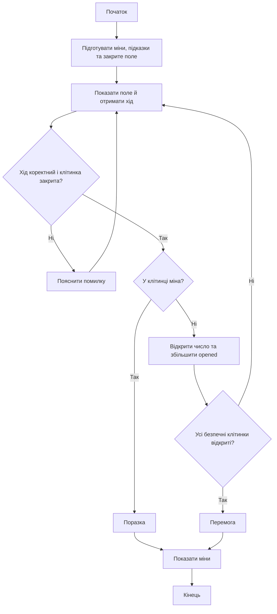

# Minesweeper: від правил гри до програми та функцій

Навчальний проєкт до занять 4–7 з Python.

**Мета:** навчитися перетворювати задачу на дані, послідовність дій і перевірки. Спочатку будуємо гру без власних функцій. Потім виділяємо зрозумілі частини в окремі функції.

> Не намагайтеся запам’ятати весь код. Для кожного фрагмента запитайте: яку задачу він розв’язує, які дані читає та що змінює?

## 1. Починаємо з проблеми, а не з Python

Уявіть паперове поле. Ведучий знає, де заховані міни. Гравець називає клітинку. Ведучий перевіряє її та повідомляє результат.

Комп’ютер має виконувати роботу ведучого:

1. Підготувати поле та розмістити міни.
2. Запам’ятати їх розташування.
3. Приймати координати від гравця.
4. Перевіряти, чи можна зробити такий хід.
5. Повідомляти, що знаходиться у вибраній клітинці.
6. Визначати перемогу або поразку.

Спочатку ми описуємо поведінку. Лише після цього вирішуємо, які цикли й колекції потрібні.

### Правила нашої версії

- Поле має розмір 8 × 8.
- На ньому розташовано 10 мін у різних клітинках.
- Гравець вводить рядок і стовпець, наприклад `3 5`.
- Нумерація починається з нуля: допустимі координати — від `0` до `7`.
- Міна у вибраній клітинці означає поразку.
- Безпечна клітинка показує кількість мін у восьми сусідніх клітинках, включно з діагональними.
- Щоб виграти, потрібно відкрити всі 54 безпечні клітинки: `8 * 8 - 10`.

Це спрощений «Сапер»: без прапорців, автоматичного відкриття порожніх ділянок і гарантовано безпечного першого ходу. Число `0` відкривається як звичайна підказка. Міни після початку гри не переміщуються.

## 2. Три рівні розуміння

| Рівень | Питання | Приклад |
| --- | --- | --- |
| Правила | Що повинно відбуватися? | Гравець відкриває клітинку; міна завершує гру |
| Алгоритм | Якими кроками це зробити? | Отримати координати → перевірити → відкрити або завершити |
| Python | Якими конструкціями це записати? | `input`, `if`, `in`, `while`, `break` |

Якщо рядок коду незрозумілий, підніміться на один рівень: спочатку назвіть його призначення словами.

Наприклад:

- Правило: відкриту клітинку не можна зарахувати повторно.
- Алгоритм: перевірити стан клітинки й відхилити повторний хід.
- Код:

```python
if hidden[row][col] != ".":
    print("This cell is already open")
    continue
```

## 3. Яку інформацію потрібно зберігати?

Комп’ютер знає більше, ніж показує гравцеві. Тому нам потрібні окремі дані про міни, підказки та видиме поле.

| Змінна | Тип | Призначення | Приклад |
| --- | --- | --- | --- |
| `SIZE` | `int` | Довжина сторони поля | `8` |
| `BOMBS` | `int` | Кількість мін | `10` |
| `bombs` | `set` | Координати мін без повторів | `{(1, 1), (2, 3)}` |
| `counts` | `dict` | Число-підказка для кожної безпечної клітинки | `{(0, 0): 1}` |
| `hidden` | `list` зі списків | Символи, які бачить гравець | `[[".", "."], [".", "."]]` |
| `opened` | `int` | Кількість відкритих безпечних клітинок | `0` |

Приклади в таблиці показують форму даних, а не повний стан поля 8 × 8.

### Координати — адреса клітинки

Пара `(row, col)` — це кортеж із двох чисел: спочатку рядок, потім стовпець.

```python
(3, 5) in bombs  # Чи є міна в рядку 3, стовпці 5?
counts[(3, 5)]   # Яка підказка для цієї безпечної клітинки?
hidden[3][5]    # Який символ зараз бачить гравець?
```

Кортеж можна використати як елемент множини та ключ словника. Звичайний список на зразок `[3, 5]` для цього не підходить.

`hidden[3][5]` читається у два кроки: взяти рядок із індексом `3`, потім елемент із індексом `5` у цьому рядку.

### Чому саме такі структури?

- **Множина `bombs`:** координати не повинні повторюватися; зручно перевіряти належність через `in`.
- **Словник `counts`:** за координатами потрібно отримати відповідне число.
- **Список списків `hidden`:** потрібно зберігати рядки та змінювати окремі клітинки.

Можливі й інші рішення. Тут вибір структур безпосередньо відповідає нашим запитанням до даних.

## 4. План програми та схема

До написання деталей достатньо такого плану:

```text
Підготувати міни.
Порахувати підказки.
Створити закрите поле.
Поки не відкриті всі безпечні клітинки:
    Показати поле.
    Отримати координати.
    Якщо хід неприйнятний — пояснити й повторити введення.
    Якщо вибрана міна — повідомити про поразку й зупинити цикл.
    Інакше — відкрити підказку та збільшити лічильник.
Якщо цикл завершився без вибуху — повідомити про перемогу.
Показати міни.
```



Схема описує звичайну гру, де є хоча б одна безпечна клітинка. Код нижче додатково перевіряє умову `while` перед першим ходом.

Для відображення схеми редактор Markdown має підтримувати Mermaid. Огорожа блока — три зворотні лапки та слово `mermaid` без зірочок; зворотні слеші наприкінці рядків не потрібні.

## 5. Розробляємо маленькими кроками

Не потрібно одразу писати повну гру. На кожному етапі додаємо одну можливість і перевіряємо її.

### Етап 1. Навчитися показувати поле

Почніть із малого розміру:

```python
SIZE = 3
hidden = [["." for col in range(SIZE)] for row in range(SIZE)]

for row in hidden:
    print(row)
```

Поки що вигляд неідеальний, але можна перевірити головне: створено три незалежні рядки по три клітинки.

Потім додайте номери рядків і стовпців та друк без дужок і ком.

### Етап 2. Змінити одну клітинку

```python
hidden[1][2] = "X"
```

Надрукуйте поле повторно. Має змінитися лише одна клітинка — у другому рядку, третьому стовпці.

Саме тому не варто писати:

```python
hidden = [["."] * SIZE] * SIZE
```

Тут зовнішнє множення повторює посилання на той самий внутрішній список. Зміна однієї клітинки проявиться в усіх рядках. У вкладеному comprehension внутрішній список створюється заново для кожного рядка.

### Етап 3. Отримати координати від людини

На цьому етапі тимчасово домовтеся вводити лише правильні координати:

```python
answer = input("Row and column: ").split()
row = int(answer[0])
col = int(answer[1])
hidden[row][col] = "X"
```

Цей фрагмент ще не захищений від помилок. Його завдання — перевірити зв’язок між введенням і зміною поля.

### Етап 4. Додати відому міну та повторення ходів

Не починайте з випадковості:

```python
bombs = {(1, 1)}
```

Тепер результат наперед відомий: вибір `1 1` має завершити гру. Інші координати — безпечні.

Помістіть отримання ходу в цикл. Додайте перевірку міни та `break`. Перевірте кілька безпечних ходів, а потім навмисно відкрийте міну.

### Етап 5. Додати підказки

Для поля 3 × 3 з єдиною міною в центрі очікувані підказки такі:

| Рядок / стовпець | 0 | 1 | 2 |
| --- | --- | --- | --- |
| 0 | 1 | 1 | 1 |
| 1 | 1 | Міна | 1 |
| 2 | 1 | 1 | 1 |

Після цього перемістіть міну в `(0, 0)`. Одиницями мають бути тільки `(0, 1)`, `(1, 0)` і `(1, 1)`. В інших безпечних клітинках — нулі. Так ви перевірите також обробку краю поля.

### Етап 6. Додати перевірки введення

Програма повинна розрізняти:

- неправильну кількість значень;
- значення, які не є допустимим записом координат;
- координати поза полем;
- вже відкриту клітинку.

Неприйнятий хід не змінює поле та `opened`.

### Етап 7. Додати перемогу

Після відкриття нової безпечної клітинки збільшуйте `opened` на один. Повторне відкриття не повинно збільшувати лічильник.

Для поля 3 × 3 з однією міною потрібно відкрити вісім клітинок. Таку перемогу легко перевірити вручну.

### Етап 8. Додати випадковість і фінальний показ мін

Коли правила вже працюють, замініть відому множину мін на випадкове розміщення. Поверніть поле 8 × 8 із десятьма мінами. Додайте показ мін після завершення.

> Відомий маленький приклад допомагає перевірити логіку. Випадковість робить гру цікавішою, але ускладнює пошук помилок.

## 6. Як працюють ключові частини

### 6.1. Випадкове розміщення мін

```python
bombs = set()
while len(bombs) < BOMBS:
    bombs.add((random.randint(0, SIZE - 1), random.randint(0, SIZE - 1)))
```

`random.randint(0, SIZE - 1)` включає обидві межі. Для `SIZE = 8` це числа від `0` до `7`.

Якщо координати вже є в множині, `add` не збільшує її розмір. Тому десять випадкових спроб не гарантують десять різних мін. Цикл `while` продовжує спроби, доки кількість унікальних координат не досягне потрібної.

Для цих прикладів задавайте цілий `SIZE > 0` та цілий `BOMBS` у межах `0 <= BOMBS < SIZE * SIZE`. Якщо попросити більше мін, ніж є клітинок, цей цикл не завершиться.

### 6.2. Підрахунок сусідів

Зовнішні цикли перебирають кожну клітинку поля:

```python
for row in range(SIZE):
    for col in range(SIZE):
```

Внутрішні цикли перебирають зміщення навколо поточної клітинки:

```python
for dr in (-1, 0, 1):
    for dc in (-1, 0, 1):
```

| `dr` / `dc` | `-1`: ліворуч | `0`: той самий стовпець | `1`: праворуч |
| --- | --- | --- | --- |
| `-1`: угору | Угорі ліворуч | Угорі | Угорі праворуч |
| `0`: той самий рядок | Ліворуч | Поточна клітинка | Праворуч |
| `1`: униз | Унизу ліворуч | Унизу | Унизу праворуч |

Для кожної комбінації перевіряємо:

```python
if (row + dr, col + dc) in bombs:
    around += 1
```

Це дев’ять комбінацій, включно з центром. Але перед підрахунком ми пропускаємо клітинки з мінами. Отже, поточна клітинка гарантовано безпечна й не додає одиницю до результату.

Координати за межами поля не спричиняють помилки: ми не звертаємося до списку за цими індексами, а перевіряємо належність кортежу множині. Наприклад, `(-1, 0) in bombs` поверне `False`, оскільки генератор не створює таких координат.

`around = 0` потрібно встановлювати перед підрахунком кожної нової клітинки. Інакше сума переноситиметься між клітинками.

### 6.3. Введення — це спочатку текст

Для введення `3 5` маємо такі перетворення:

| Крок | Результат |
| --- | --- |
| `input(...)` | Рядок `"3 5"` |
| `.split()` | Список `['3', '5']` |
| `int(answer[0])` | Ціле число `3` |
| `int(answer[1])` | Ціле число `5` |

Спочатку перевіряємо кількість частин, а вже потім звертаємося до них.

В умові з `or` Python припиняє перевірку, щойно знаходить істинну частину. Тому якщо довжина неправильна, вирази з `answer[0]` та `answer[1]` не виконуються. Це називається коротким замиканням.

У початковій чернетці використано `isdigit()`. Для звичайного введення `0`–`7` цього вистачає, але деякі символи, наприклад `²`, проходять `isdigit()` і не перетворюються через `int()`.

У повних прикладах нижче використано `isdecimal()`: він підходить для перевірки десяткових цифр у цьому форматі введення. Мінус і десяткова крапка не приймаються: `-1` та `2.5` — не допустимі координати.

### 6.4. `continue`, `break` та `while ... else`

| Конструкція | Дія | Приклад у грі |
| --- | --- | --- |
| `continue` | Пропускає решту поточної ітерації найближчого циклу | Помилковий хід: повторюємо запит |
| `break` | Завершує найближчий цикл | Відкрили міну |
| `else` після `while` | Виконується, коли цикл завершується без `break` | Відкрито всі безпечні клітинки |

`else` належить до `while`, а не до останнього `if`: звертайте увагу на відступи.

Після `break` програма не зникає — виконання продовжується після циклу та його `else`. Саме там ми показуємо міни.

## 7. Повна версія без власних функцій

Скопіюйте цей блок у файл `minesweeper.py` і запустіть:

```bash
python minesweeper.py
```

Потрібен Python 3. Сторонні пакети не потрібні: `random` входить до стандартної бібліотеки.

Ця версія зберігає структуру чернетки. Дві невеликі зміни: заголовок будується з `SIZE`, а перевірка цифр використовує `isdecimal()`.

```python
import random

SIZE = 8
BOMBS = 10

# 1. Розміщуємо міни в різних клітинках.
bombs = set()
while len(bombs) < BOMBS:
    bombs.add((random.randint(0, SIZE - 1), random.randint(0, SIZE - 1)))

# 2. Рахуємо підказки для безпечних клітинок.
counts = {}
for row in range(SIZE):
    for col in range(SIZE):
        if (row, col) in bombs:
            continue
        around = 0
        for dr in (-1, 0, 1):
            for dc in (-1, 0, 1):
                if (row + dr, col + dc) in bombs:
                    around += 1
        counts[(row, col)] = around

# 3. Створюємо незалежні рядки закритого поля.
hidden = [["." for col in range(SIZE)] for row in range(SIZE)]
opened = 0

# 4. Повторюємо ходи.
while opened < SIZE * SIZE - BOMBS:
    header = "  "
    for col in range(SIZE):
        header += " " + str(col)
    print(header)
    for row in range(SIZE):
        line = str(row) + " "
        for cell in hidden[row]:
            line += " " + cell
        print(line)

    answer = input("Row and column, for example 3 5: ").split()
    if len(answer) != 2 or not answer[0].isdecimal() or not answer[1].isdecimal():
        print("Type two whole numbers from 0 to", SIZE - 1)
        continue

    row, col = int(answer[0]), int(answer[1])
    if row >= SIZE or col >= SIZE:
        print("This cell is outside the board")
        continue
    if hidden[row][col] != ".":
        print("This cell is already open")
        continue
    if (row, col) in bombs:
        print("Boom! Game over.")
        break

    hidden[row][col] = str(counts[(row, col)])
    opened += 1
else:
    print("You win!")

# 5. Показуємо міни після перемоги або поразки.
for row, col in bombs:
    hidden[row][col] = "*"

header = "  "
for col in range(SIZE):
    header += " " + str(col)
print(header)
for row in range(SIZE):
    line = str(row) + " "
    for cell in hidden[row]:
        line += " " + cell
    print(line)
```

Перевірки від’ємних індексів тут немає, оскільки знак мінус відхиляється ще до `int()`. Якщо зміните спосіб введення, перегляньте й перевірку меж. Просте форматування друку розраховане на однозначні номери рядків і стовпців.

## 8. Простежимо один хід вручну

Візьмемо поле 3 × 3, одну міну `(1, 1)` та початкове значення `opened = 0`.

| Введення | Результат перевірки | Зміна поля | `opened` після ходу |
| --- | --- | --- | --- |
| `0 0` | Безпечна закрита клітинка | `hidden[0][0] = "1"` | `1` |
| `0 0` повторно | Клітинка вже відкрита | Немає | `1` |
| `9 0` | Поза полем | Немає | `1` |
| `hello` | Неправильний формат | Немає | `1` |
| `1 1` | Міна | Цикл припиняється; потім показуються міни | `1` |

Зверніть увагу: `bombs` і `counts` під час ходів не змінюються. Змінюються `hidden` та `opened`.

### Що має залишатися правильним після кожного ходу?

Такі незмінні правила називають інваріантами:

- Кількість мін і їх координати залишаються сталими.
- `opened` дорівнює кількості відкритих безпечних клітинок.
- Неприйнятий хід не змінює стан гри.
- До завершення гри безпечна відкрита клітинка містить число, закрита — крапку.
- Підказки відповідають початковому розташуванню мін.

Якщо лічильник збільшився після повторного відкриття, порушено друге правило. Тоді вже зрозуміло, яку частину коду перевіряти.

## 9. Навіщо тут функції?

Гра вже працює без власних функцій. Але друк поля написано двічі. Якщо потрібно змінити його вигляд, доведеться виправляти обидві копії.

Крім повторення, є проблема читання: серед деталей введення й друку важко швидко побачити основні правила гри.

Функція дає назву окремій дії. Замість довгого фрагмента ми можемо прочитати:

```python
print_board(hidden)
```

Це означає «показати поле». Деталі друку можна розглядати окремо.

Перенесення коду у функції зі збереженням поведінки називається **рефакторингом**. На цьому етапі ми не додаємо нових правил гри.

### Починаємо з однієї функції

```python
def print_board(board):
    size = len(board)
    header = "  "
    for col in range(size):
        header += " " + str(col)
    print(header)
    for row in range(size):
        line = str(row) + " "
        for cell in board[row]:
            line += " " + cell
        print(line)
```

- `def` починає визначення функції.
- `print_board` — її назва.
- `board` — параметр: так поле називається всередині функції.
- Відступи визначають тіло функції.
- Визначення функції саме по собі не друкує поле.
- `print_board(hidden)` викликає функцію та передає їй наше поле.

Після визначення замініть обидва фрагменти друку на `print_board(hidden)` і перевірте, що гра працює так само.

### `print` і `return` — різні дії

`print` показує інформацію людині. `return` передає результат коду, який викликав функцію, і завершує поточний виклик.

```python
def create_board(size):
    return [["." for col in range(size)] for row in range(size)]

hidden = create_board(8)
```

Тут функція створює поле, а `return` повертає його. Саме повернений список потрапляє в `hidden`.

`print_board` нічого явно не повертає, тому її результат — `None`. Не пишіть `hidden = print_board(hidden)`: так ви заміните поле на `None`.

## 10. Домовляємося про відповідальність функцій

Перед написанням функції дайте відповідь на три запитання: що вона отримує, що робить і що повертає або змінює?

| Функція | Отримує | Результат або дія |
| --- | --- | --- |
| `create_bombs(size, bomb_count)` | Розмір і кількість мін | Повертає множину координат |
| `calculate_counts(size, bombs)` | Розмір і міни | Повертає словник підказок |
| `create_board(size)` | Розмір | Повертає нове закрите поле |
| `print_board(board)` | Видиме поле | Друкує його; не змінює |
| `read_move(size)` | Розмір | Запитує координати до коректного введення; повертає пару |
| `reveal_bombs(board, bombs)` | Поле й міни | Змінює передане поле: ставить `*` |
| `play(size, bomb_count)` | Параметри гри | Керує підготовкою, ходами та завершенням |

`read_move` перевіряє формат і межі. Перевірки «вже відкрито?» та «це міна?» залишаються в `play`, бо вони залежать від стану гри.

Не обов’язково створювати функцію для кожного `if`. Коротку послідовність правил зручно бачити разом.

## 11. Можливе рішення з функціями

Це самостійний варіант програми. Його можна скопіювати в окремий файл `minesweeper_functions.py` і запустити командою `python minesweeper_functions.py`.

Функції отримують необхідні дані через параметри. Глобальні змінні зі станом гри не потрібні.

```python
import random


def create_bombs(size, bomb_count):
    bombs = set()
    while len(bombs) < bomb_count:
        row = random.randint(0, size - 1)
        col = random.randint(0, size - 1)
        bombs.add((row, col))
    return bombs


def calculate_counts(size, bombs):
    counts = {}
    for row in range(size):
        for col in range(size):
            if (row, col) in bombs:
                continue
            around = 0
            for dr in (-1, 0, 1):
                for dc in (-1, 0, 1):
                    if (row + dr, col + dc) in bombs:
                        around += 1
            counts[(row, col)] = around
    return counts


def create_board(size):
    return [["." for col in range(size)] for row in range(size)]


def print_board(board):
    size = len(board)
    header = "  "
    for col in range(size):
        header += " " + str(col)
    print(header)
    for row in range(size):
        line = str(row) + " "
        for cell in board[row]:
            line += " " + cell
        print(line)


def read_move(size):
    while True:
        answer = input("Row and column, for example 0 0: ").split()
        if len(answer) != 2 or not answer[0].isdecimal() or not answer[1].isdecimal():
            print("Type two whole numbers from 0 to", size - 1)
            continue
        row, col = int(answer[0]), int(answer[1])
        if row >= size or col >= size:
            print("This cell is outside the board")
            continue
        return row, col


def reveal_bombs(board, bombs):
    for row, col in bombs:
        board[row][col] = "*"


def play(size, bomb_count):
    # У цьому навчальному варіанті очікуємо цілі параметри.
    if size <= 0 or bomb_count < 0 or bomb_count >= size * size:
        print("Use size > 0 and 0 <= bomb_count < size * size")
        return

    bombs = create_bombs(size, bomb_count)
    counts = calculate_counts(size, bombs)
    hidden = create_board(size)
    opened = 0
    safe_cells = size * size - bomb_count

    while opened < safe_cells:
        print_board(hidden)
        row, col = read_move(size)

        if hidden[row][col] != ".":
            print("This cell is already open")
            continue
        if (row, col) in bombs:
            print("Boom! Game over.")
            break

        hidden[row][col] = str(counts[(row, col)])
        opened += 1
    else:
        print("You win!")

    reveal_bombs(hidden, bombs)
    print_board(hidden)


play(8, 10)
```

### Що потрібно помітити в цьому варіанті?

**Головний сценарій читається коротше.** У `play` видно підготовку, цикл ходів, перевірки та завершення. Деталі друку й введення мають власні назви.

**Назви параметрів локальні.** Під час `print_board(hidden)` параметр `board` посилається на передане поле. Назви `board` і `hidden` не повинні збігатися.

**Список не копіюється автоматично.** `reveal_bombs` змінює клітинки того самого списку, який передано з `play`. Тому після виклику зірочки вже є в `hidden`. Це свідома домовленість цієї функції.

**`return row, col` повертає пару.** Запис `row, col = read_move(size)` розпаковує отриманий кортеж у дві змінні.

**`return` завершує функцію.** У `read_move` він виходить і з циклу `while True`, і з самого виклику функції, коли координати прийнятні.

**Правила гри збереглися.** Відмінність інтерфейсу: після неправильного формату або виходу за межі `read_move` одразу повторює запит, не передруковуючи незмінене поле. У версії без функцій поле в цих випадках друкується знову.

## 12. Як перевіряти, що нічого не зламалося

Для перевірки з відомою міною використайте `size = 3`, одну міну `(1, 1)`. У версії з функціями тимчасово замініть у `play` рядок створення мін на `bombs = {(1, 1)}` і викличте `play(3, 1)`. Після перевірки поверніть генератор.

| Сценарій | Очікувана поведінка |
| --- | --- |
| Ввести `0 0` | Відкривається `1`, лічильник збільшується на один |
| Повторити `0 0` | Повідомлення про відкриту клітинку; лічильник не змінюється |
| Ввести `1 1` | Поразка; повідомлення про перемогу немає |
| Відкрити всі вісім клітинок без міни | Перемога |
| Ввести порожній рядок, `hello`, `1`, `1 2 3` | Повідомлення про формат; новий запит |
| Ввести `-1 0`, `1.5 0`, `² 0` | Повідомлення про формат; новий запит |
| Ввести `3 0` на полі 3 × 3 | Повідомлення про вихід за межі |
| Ввести `  0   2  ` | Пробіли обробляються, координати приймаються |
| Завершити гру будь-яким результатом | На фінальному полі видно міну |

Для автоматичного відкриття всіх безпечних клітинок або аналізу випадковості знадобляться окремі перевірки. На цьому занятті достатньо свідомо пройти основні сценарії на маленькому полі.

## 13. Типові помилки та їх причини

| Помилка | Чому це проблема | Як виправити |
| --- | --- | --- |
| `bombs = {}` | Створюється словник | Порожня множина — `set()` |
| `bombs.add([row, col])` | Список не можна додати до множини | Використати кортеж `(row, col)` |
| Десять випадкових спроб замість контролю кількості | Координати можуть повторюватися | Перевіряти `len(bombs)` у `while` |
| `[["."] * SIZE] * SIZE` | Рядки посилаються на той самий список | Створювати кожен рядок окремо |
| `around = 0` поза перебором клітинок | Підрахунки накопичуються між клітинками | Обнуляти перед кожною безпечною клітинкою |
| `opened += 1` до перевірок | Помилкові та повторні ходи наближають перемогу | Збільшувати лише після нового безпечного відкриття |
| Звернення до `hidden[row][col]` до перевірки меж | Можливий `IndexError` | Спочатку перевірити координати |
| Звернення до `counts` для міни | Для мін у словнику немає ключів | Спочатку перевірити `bombs` |
| `hidden = print_board(hidden)` | Функція друку повертає `None` | Викликати без присвоєння |
| Після перенесення коду функція не викликана | `def` лише визначає дію | Додати відповідний виклик |

## 14. Запитання для самоперевірки

Спробуйте відповісти без запуску програми.

1. Чому `bombs` і `hidden` — різні структури?
2. Чому для розміщення мін використано `while`, а не рівно десять ітерацій `for`?
3. Які дані змінюються після успішного ходу?
4. Чому повторне відкриття не повинно змінювати `opened`?
5. Чому перевірку меж ставимо перед зверненням до клітинки?
6. Чому дев’ять комбінацій зміщень не додають зайву міну в центрі?
7. Чому `else` після `while` не виконується після вибуху?
8. Чим `return` відрізняється від `print`?
9. Чому `reveal_bombs` змінює поле без `return board`?
10. Яку частину ви зміните, якщо захочете інший вигляд поля у версії з функціями?

<details>
<summary>Короткі відповіді</summary>

1. `bombs` зберігає приховану інформацію, а `hidden` — поточний вигляд поля для гравця.
2. Випадкові координати можуть повторюватися; потрібні десять унікальних мін.
3. Одна клітинка `hidden` та лічильник `opened`.
4. Нова безпечна клітинка не відкрилася.
5. Щоб не звертатися до індексу за межами списку.
6. Підказки рахуємо тільки для безпечних клітинок; у центрі міни немає.
7. `break` пропускає блок `else` цього циклу.
8. `return` завершує виклик і повертає результат коду; `print` виводить текст.
9. Функція отримала той самий змінюваний список і змінила його елементи.
10. `print_board`.

</details>

## 15. Практика: рухаємося від розуміння до змін

### Завдання А. Пояснити програму без синтаксису

За одну хвилину опишіть гру людині, яка не знає Python. Використовуйте слова «поле», «хід», «перевірка», «міна», «перемога». Потім знайдіть у коді частину, яка відповідає кожній дії.

### Завдання Б. Відтворити стан

На полі 3 × 3 є міна `(0, 0)`. Гравець відкрив `(2, 2)`, потім `(0, 1)`. Запишіть на папері `hidden` та значення `opened`. Поясніть, чому показані саме такі числа.

### Завдання В. Зробити перший рефакторинг

Візьміть версію без функцій. Винесіть тільки друк у `print_board`. Замініть обидві копії друку. Перевірте поразку та перемогу на малому полі.

### Завдання Г. Додати решту функцій по одній

Порядок: `create_board` → `create_bombs` → `calculate_counts` → `read_move` → `reveal_bombs` → `play`.

Після кожного кроку перевіряйте поведінку. Не переносіть усе відразу: так важче знайти причину помилки.

### Завдання Ґ. Розширити гру після рефакторингу

Оберіть одну зміну:

- показувати кількість ще не відкритих безпечних клітинок;
- рахувати тільки прийняті ходи;
- додати команду виходу `q` і домовитися, яке значення повертатиме `read_move`;
- дати вибір між двома розмірами поля з відповідною кількістю мін.

Автоматичне відкриття порожніх ділянок залиште на окреме заняття: воно потребує обходу сусідніх клітинок і контролю вже оброблених позицій. Це новий алгоритм, а не лише винесення коду у функцію.

---

**Орієнтир під час роботи:** правило гри → потрібні дані → алгоритм → код → перевірка на відомому прикладі → виділення зрозумілих дій у функції.

## 16. Віконний інтерфейс: стандартний модуль `tkinter`

Для простого графічного інтерфейсу Python має стандартний модуль **`tkinter`**. Він дозволяє створювати вікна, кнопки та текстові написи. У деяких установках Python компонент Tk потрібно встановити окремо.

Перевірити його доступність можна командою:

```bash
python -m tkinter
```

Якщо з’явилося демонстраційне вікно, модуль доступний. Графічний приклад запускайте локально як `.py`-файл у середовищі з робочим столом.

### Що змінюється порівняно з консоллю?

| Консольна гра | Віконна гра |
| --- | --- |
| `input()` отримує координати | Натискання кнопки визначає координати |
| `print()` показує поле | Поле складається з кнопок |
| Наш `while` організовує ходи | `mainloop()` очікує події вікна |
| Код одразу обробляє введення | Функція-обробник викликається після натискання |

**Правила та дані залишаються знайомими.** Міни — множина, підказки — словник, відкриті клітинки — множина координат. Змінюється спосіб взаємодії з гравцем.

Не потрібно додавати консольний цикл з `input()` усередину інтерфейсу: він блокуватиме обробку подій вікна. Кожне натискання має швидко виконати один хід і повернути керування `mainloop()`.

### Повний приклад без класів

Це додатковий матеріал **після знайомства з функціями**. Він вводить нові поняття: віджети, обробники подій та вкладену функцію. Для розуміння основної консольної гри цей розділ не обов’язковий.

Збережіть код як `minesweeper_ui.py` та запустіть `python minesweeper_ui.py`. Під час гри відкривайте клітинки лівою кнопкою миші. Щоб зіграти знову, перезапустіть програму.

```python
import random
import tkinter as tk


def create_bombs(size, bomb_count):
    bombs = set()
    while len(bombs) < bomb_count:
        bombs.add((random.randint(0, size - 1), random.randint(0, size - 1)))
    return bombs


def calculate_counts(size, bombs):
    counts = {}
    for row in range(size):
        for col in range(size):
            if (row, col) in bombs:
                continue
            around = 0
            for dr in (-1, 0, 1):
                for dc in (-1, 0, 1):
                    if (row + dr, col + dc) in bombs:
                        around += 1
            counts[(row, col)] = around
    return counts


def finish_game(message):
    status.config(text=message)
    for row, col in bombs:
        buttons[row][col].config(text="*", bg="salmon")
    for button_row in buttons:
        for button in button_row:
            button.config(state=tk.DISABLED)


def open_cell(row, col):
    if (row, col) in opened:
        return
    if (row, col) in bombs:
        finish_game("Boom! Game over.")
        return

    opened.add((row, col))
    buttons[row][col].config(
        text=str(counts[(row, col)]),
        state=tk.DISABLED,
        relief=tk.SUNKEN,
    )
    remaining = SIZE * SIZE - BOMBS - len(opened)
    status.config(text="Safe cells left: " + str(remaining))
    if remaining == 0:
        finish_game("You win!")


def make_click_handler(row, col):
    # Створюємо окремий обробник, який пам’ятає координати кнопки.
    def handle_click():
        open_cell(row, col)
    return handle_click


SIZE = 8
BOMBS = 10
bombs = create_bombs(SIZE, BOMBS)
counts = calculate_counts(SIZE, bombs)
opened = set()

window = tk.Tk()
window.title("Minesweeper")
window.resizable(False, False)

status = tk.Label(window, text="Open all safe cells", pady=10)
status.pack()

board_frame = tk.Frame(window, padx=10, pady=10)
board_frame.pack()

buttons = []
for row in range(SIZE):
    button_row = []
    for col in range(SIZE):
        button = tk.Button(
            board_frame,
            text=".",
            width=3,
            height=1,
            font=("Arial", 16),
            command=make_click_handler(row, col),
        )
        button.grid(row=row, column=col, padx=1, pady=1)
        button_row.append(button)
    buttons.append(button_row)

window.mainloop()
```

### Як читати цей код

1. `tk.Tk()` створює головне вікно.
2. `Label` показує повідомлення, `Frame` групує поле, `Button` представляє клітинку.
3. `grid(row=..., column=...)` розміщує кнопки в рядках і стовпцях.
4. `command` отримує функцію, яку потрібно викликати після натискання.
5. `config(...)` змінює текст, вигляд або доступність віджета.
6. `mainloop()` запускає обробку подій і працює до закриття вікна.

`pack` розміщує напис і рамку всередині `window`, а `grid` — кнопки всередині іншого контейнера, `board_frame`. Не змішуйте `pack` і `grid` для дочірніх елементів одного й того самого контейнера.

### Чому не `command=open_cell(row, col)`?

Такий запис **одразу викликав би** `open_cell` під час створення кнопки. У `command` потрапив би результат виклику, а потрібна функція для майбутнього натискання.

`make_click_handler(row, col)` зараз створює й повертає іншу функцію — `handle_click`. Вона пам’ятає координати конкретної кнопки й відкриє клітинку пізніше. Це приклад замикання; його можна розібрати окремо після параметрів і `return`.

У цьому невеликому UI-прикладі обробники читають спільні змінні модуля (`buttons`, `bombs`, `counts`, `opened`, `status`). Це свідоме спрощення. Ми змінюємо вміст множини й властивості віджетів, а не переприсвоюємо ці змінні, тому `global` не потрібен. Для більшої програми організацію стану варто переглянути після вивчення класів.

### Що перевірити у віконній версії

- Натискання безпечної клітинки показує число та робить кнопку недоступною.
- Лічильник зменшується лише після відкриття нової безпечної клітинки.
- Натискання міни показує поразку й усі міни.
- Після завершення всі кнопки недоступні.
- На полі 3 × 3 з однією відомою міною відкриття восьми безпечних клітинок дає перемогу.

UI-приклад не додає автоматичного відкриття нулів або захисту першого ходу: він демонструє ті самі правила через кнопки.
